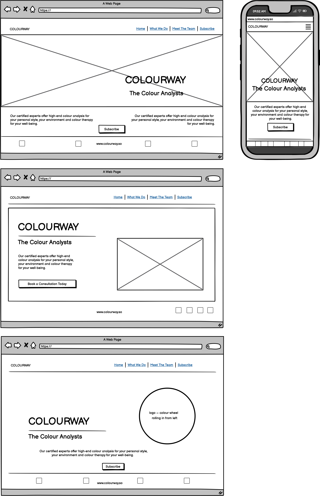

# Welcome to COLOURWAY: Your Colour Analysts.

## Mock-up

At COLOURWAY, we believe that colour isn't just a visual experience; it's a language that speaks volumes about who we are and how we interact with the world around us. We're not your typical colour consultants – we're your personal guides to understanding the power of colour in your life. Overall, this website could offer a clean, practical, and user-friendly platform for individuals to explore the transformative power of colour and integrate it into their daily routines in meaningful ways.

## About Us

COLOURWAY: Your Colour Analysts is dedicated to providing a fresh and practical approach to colour analysis. Our team of certified experts offers personalised one-on-one consultations to help you discover the perfect palette for your personal style and everyday environment. But we're more than just consultants; we're a community dedicated to exploring the transformative effects of colour through workshops and colour therapy sessions designed to enhance your well-being.

## Our Approach

At COLOURWAY, simplicity and practicality are at the heart of everything we do. We understand that navigating the world of colour can be overwhelming, which is why we've developed a straightforward process that demystifies the complexities of colour analysis. Whether you're revamping your wardrobe or redesigning your living space, our experts are here to guide you every step of the way.

## What We Offer

- Personalised one-on-one colour consultations
- Community workshops and colour therapy sessions
- Certified experts with a passion for colour
- Simple and practical approach to colour analysis

Join us on a journey to discover the transformative power of colour at COLOURWAY: Your Colour Analysts.

At COLOURWAY, we believe that simplicity and practicality are the cornerstones of effective design. Our website is a testament to this philosophy, offering a bold and intuitive user experience that puts the transformative power of colour front and centre.

## Design Philosophy

Our design ethos is rooted in the idea that less is more. We've embraced clean lines, minimalist layouts, and bold colour choices to create an interface that is both visually striking and easy to navigate. Every element has been carefully considered to ensure a seamless user experience, from the intuitive navigation menu to the vibrant colour palettes that adorn each page.

## User Experience

When you visit our website, you'll immediately notice the simplicity of our design. We've eschewed unnecessary clutter in favour of clean, uncluttered layouts that allow our content to shine. Whether you're browsing our services or exploring our community events, you'll find that everything is just a click away, thanks to our intuitive navigation system.

## Bold Choices

While our design may be simple, that doesn't mean it's lacking in impact. We've made bold choices in our use of colour and typography to create a website that stands out from the crowd. Vibrant hues and eye-catching fonts draw the user's attention and create a memorable visual identity for our brand.

## Accessibility

In keeping with our commitment to practicality, we've ensured that our website is accessible to all users, regardless of their device or ability. Our responsive design adapts seamlessly to any screen size, while our use of semantic HTML ensures compatibility with screen readers and other assistive technologies.

## Conclusion

At COLOURWAY: Your Colour Analysts, we believe that design should be both beautiful and functional. Our website is a testament to this belief, offering a simple, practical, and bold user experience that puts the transformative power of colour at your fingertips. Join us on a journey to discover the true impact of colour in your life. Welcome to a world where every shade narrates a unique story, and where the potential is as vast as the colour spectrum itself.

## Table of Contents

## User Experience (UX)
The 5 S's

### Project Goals

### User goals

### Site Owner Goals

### Target Audience

### User Stories

### First Time User

### Returning User

### Site Owner

### Design Choices

### Colors

### Fonts

### Structure

### Wireframes

## Features

### Logo and Navbar

### Favicon

### Heading

### Footer

### Pages

## Frameworks and Programs Used

### Codeanywhere

Codeanywhere was used for writing code, committing, and then pushing to GitHub. GitHub

### Google Fonts

Google Fonts was used to import the fonts Barlow Condensed into the style.css file. These fonts were used throughout the site.

### Font Awesome

Font Awesome was used throughout all pages to add icons in order to create a better visual experience for User experience purposes.

### Balsamiq

Balsamiq was used to create the wireframes during the design phase of the project.

### Multi Device Website Mockup Generator

Responsive Design Checker was used in the testing process to check responsiveness on various devices and to generate mockup image.

### Chrome DevTools

Chrome DevTools was used during development process for code review and to test responsiveness.

### Coolers Contrast Checker

Coolers Contrast Checker was used to make sure the colors I used contrasted well enough for all users

### Languages used

The languages used in this project are:

HTML

CSS

## Testing

### Validator Testing

### HTML & CSS

### Accessibility

1. Lighthouse testing

2. Semantic HTML

Semantic HTML tags were used to provide a clear and meaningful structure to the website content. This helps screen readers and other assistive technologies interpret and convey information accurately.

3. ARIA (Accessible Rich Internet Applications)
ARIA attributes were utilised on links to enhance the accessibility of the site allowing for screen readers to accurately pick up information.

4. Contrast and Readability
Coolers Contrast Checker was used to ensure sufficient contrast in colors chosen to make the content readable for users with visual impairments.

5. Alt Text for Images
All images on the website include descriptive alternative text (alt text). This helps users with visual impairments understand the content and context of images even if they cannot see them.

6. Responsive Design
The website is responsive, providing a seamless experience across various devices and screen sizes. This benefits users with different abilities and ensures a consistent and accessible user experience.

This was tested via Chrome DevTools as the project progressed.

### Manual Testing

### Common Elements

### Performance

### Browser Compatibilty

## Finished Product

## Deployment
I deployed early:

Login to sarahmclo GitHub account
Navigate to my project repository colourway
Click the Settings near the top of the page
In the left-hand menu, find and click on the Pages
In the Source section, choose 'main' from the drop-down, select branch menu
Select 'root' from the drop-down folder menu
Click 'Save' and after a few moments the project will have been made live and a link is visible at the top of the page

## GitHub

## Bugs

## Credits

### Content
All content written for the website is by myself, is purely fictional, and for educational purposes only.

### Media

### Code

## Acknowledgements
