# Colourway *Your Colour Analysts*
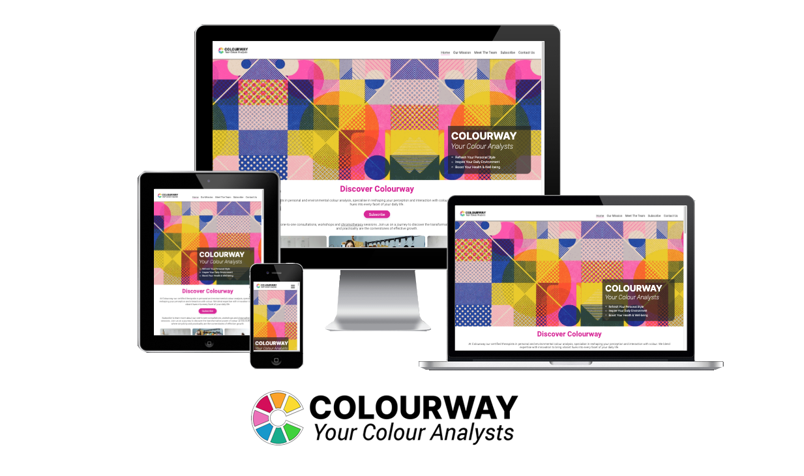

Welcome to COLOURWAY, Your Colour Analysts. With this site we offer a clean, practical, and user-friendly platform for individuals to explore the transformative power of colour and integrate it into their daily routines in meaningful ways. We believe that simplicity and practicality are the cornerstones of effective design, our website is a testament to this philosophy, offering a bold and intuitive user experience that puts the transformative power of colour front and centre in a personal yet practical way. Our website calls on our user to subscribe to the COLOURWAY community for exclusive information and offers.

[View Colourway Live Here](https://sarahmclo.github.io/colourway/)

## Table of Contents
1. [User Experience (UX)](#user-experience)
    - [Project Goals](#project-goals)
    - [User stories](#user-stories)
    - [Target Audience Goals](#target-audience-goals)
    - [Site Owner Goals](#site-owner-goals)
    - [First Time User Goals](#first-time-user-goals)
    - [Return User Goals](#return-user-goals)
2. [Design](#design)
    - [Design Philosophy](#design-philosophy)
    - [Design Choices](#design-choices)
    - [Colours](#colours)
    - [Typography](#typography)
    - [Imagery](#imagery)
    - [Structure](#structure)
    - [Wireframes](#wireframes)
3. [Features](#features)
    - [Logo and Navbar](#logo-and-navbar)
    - [Favicon](#favicon)
    - [Headings](#headings)
    - [Main Content](#main-content)
    - [Footer](#footer)
    - [Pages](#pages)
4. [Technologies Utilised](#technologies-utilised)
    - [Languages](#languages)
    - [Frameworks and Programs](#frameworks-and-programs)
5. [Deployment](#deployment)
    - [Remote Deployment](#remote-deployment)
    - [Local Deployment](#local-deployment)
6. [Testing](#testing)
    - [Validation Testing](#validation-testing)
    - [Manual Testing](#manual-testing)
7. [Bugs](#bugs)
8. [Finished Product](#finished-product)
9. [Future Features](#future-features)
10. [Credits](#credits)
    - [Content](#content)
    - [Media](#media)
    - [Code](#code)
11. [Conclusion](#conclusion)
12. [Acknowledgements](#acknowledgements)

## User Experience (UX)

When you visit our website, you'll immediately notice the simplicity of our design. We've eschewed unnecessary clutter in favour of clean, uncluttered layouts that allow our content to shine. Whether you're browsing our services or exploring our community events, you'll find that everything is just a click away, thanks to our intuitive navigation system.

### Project Goals

- Develop a user-friendly website that emphasizes the transformative power of colour.
- Ensure the website is responsive across all devices.
- Implement a clean and practical design philosophy to enhance user experience.
- Prioritize simplicity and practicality in design to ensure intuitive navigation.
- Create a bold and visually striking interface that highlights the importance of what the company has to offer.
- Ensure the main call to action - "Subscribe" is clear to develop a community of users.
- Showcase what the company has to offer in regards to personal consultations and workshops.
- Offer exclusive information and offers to subscribers, fostering a strong community.
- Ensure high performance and scalability to accommodate increasing user engagement.
- Meet project deadlines and budget constraints effectively throughout development.

### User Stories

- Explore the transformative power of color through engaging content.
- Clean and practical website design for easy navigation.
- Find valuable resources and information about color theory and its applications.
- Subscribe to the Colourway community for exclusive content and offers.
- Access the website seamlessly across different devices for a consistent experience.
- Discover workshops and events related to color exploration and analysis.
- Share my experiences and insights about color with the Colourway community.
- Learn about the psychology and symbolism of different colors.
- Connect with like-minded individuals who appreciate the importance of color in daily life.
- Receive updates and notifications about new content and events from Colourway.

### Target Audience Goals

- Individuals Seeking Personal Transformation: People who are interested in exploring how color can positively impact their lives and enhance their personal growth journey.
- Creatives and Artists: Designers, artists, and creatives who are looking for inspiration and guidance in their color choices and compositions.
- Fashion Enthusiasts: Individuals who are passionate about fashion and want to understand how color influences style and trends.
- Home Decorators: Homeowners and interior decorators who are looking to create harmonious and visually appealing living spaces through strategic color choices.
- Influencers: Colourway is valuable resource for enhancing their content, engaging their audience, and establishing themselves in the growing realm of colour analysis and aesthetics.
- Small Business Owners: Entrepreneurs and small business owners who want to use color effectively in branding and marketing their products or services.
- Therapists and Counselors: Professionals in the mental health field who recognize the therapeutic potential of color and its impact on mood and emotions.
- Educators and Students: Teachers, students, and researchers interested in learning more about the science and psychology of color for academic or personal development purposes.

### Site Owner Goals

- Provide Valuable Content: The site aims to offer high-quality and informative content on color theory, analysis, and application to engage and educate visitors.
- Build a Strong Community: The site seeks to cultivate a vibrant and active community of color enthusiasts who share insights, experiences, and resources related to color exploration and analysis.
- Drive User Engagement: The site aims to encourage user interaction through comments, discussions, and participation in workshops, events, and other activities related to color.
- Grow Subscriber Base: The site owner aims to increase the number of subscribers to the Colourway community by offering exclusive content, discounts, and offers to incentivize sign-ups.
- Establish Authority: The site owner aims to position Colourway as a trusted authority in the field of color analysis and aesthetics, attracting visitors seeking expert guidance and insights.
- Monetize Through Partnerships: The site owner may explore monetization opportunities through partnerships with brands, sponsors, or advertisers interested in reaching Colourway's audience of color enthusiasts.
-Track and Analyze Performance: The site owner aims to monitor and analyze key metrics such as traffic, engagement, and conversion rates to optimize the site's performance and user experience continually.
- Maintain Brand Consistency: The site owner aims to ensure consistency in branding, messaging, and visual identity across all aspects of the Colourway website to reinforce its unique value proposition and enhance brand recognition.
- Stay Updated with Trends: The site owner aims to stay abreast of emerging trends, developments, and best practices in color analysis and aesthetics to keep the content fresh, relevant, and engaging for visitors.
- Provide Excellent User Experience: The site owner aims to prioritize user experience by implementing intuitive navigation, responsive design, and accessible content to ensure a seamless and enjoyable browsing experience for visitors across all devices and platforms.

### First Time User Goals

- Discover the Website: The first-time user's goal is to explore the Colourway website and get an overall sense of its purpose, content, and offerings.
- Learn About Colour Analysis: Users want to learn about the concept of color analysis, its significance, and how it can impact various aspects of their lives.
 - Find Valuable Resources: Users aim to discover valuable resources such as articles, guides, and videos that provide insights into color theory,psychology, and application.
- Understand the Community: Users want to understand the nature of the Colourway community, including its members, activities, and opportunities for engagement and collaboration.
- Subscribe for Exclusive Content: Users may be interested in subscribing to the Colourway community to access exclusive content, offers, and updates.
- Navigate Easily: Users expect to navigate the website easily and intuitively, finding the information they need without confusion or frustration.
- Access Responsive Design: Users expect the website to be responsive and accessible across various devices and screen sizes, ensuring a seamless browsing experience.
- Get Inspired: Users want to feel inspired and motivated by the content on the Colourway website, sparking ideas and creativity related to color exploration and analysis.
- Learn About Workshops and Events: Users may be interested in learning about upcoming workshops, events, or seminars related to color analysis and aesthetics.
- Connect with Like-Minded Individuals: Users aim to connect with other like-minded individuals who share their interest in color and aesthetics, fostering meaningful connections and relationships within the Colourway community.

### Return User Goals

- Explore New Content: Return users aim to explore new articles, videos, or resources that have been added since their last visit to stay updated on the latest trends and developments in color analysis.
- Engage with the Community: Return users seek to engage with the Colourway community by participating in discussions, sharing insights, and connecting with other members who share their passion for color exploration.
- Attend Workshops or Events: Return users may be interested in attending upcoming workshops, events, or seminars hosted by Colourway to further their knowledge and skills in color analysis and aesthetics.
- Access Exclusive Content: Return users want to access exclusive content, offers, or discounts available to subscribed members of the Colourway community.
- Stay Informed: Return users aim to stay informed about updates, announcements, and new features on the Colourway website by checking for notifications or subscribing to the newsletter.
- Share Feedback: Return users may want to share feedback, suggestions, or testimonials with the Colourway team to help improve the website and community experience.
- Refer Friends: Return users may refer friends or colleagues to the Colourway website, encouraging them to join the community and explore the transformative power of color together.
- Participate in Challenges: Return users may participate in challenges or activities organized by Colourway to apply color analysis principles in their daily lives and share their experiences with the community.
- Connect on Social Media: Return users may follow Colourway on social media platforms to stay connected, share content, and engage with other members of the community beyond the website.
- Continue Personal Growth: Return users aim to continue their personal growth journey with Colourway, using color analysis as a tool for self-discovery, creativity, and expression in their lives.

## Design 

### Design Philosophy
Our design ethos is rooted in the idea that less is more. We've embraced clean lines, minimalist layouts, and bold colour choices to create an interface that is both visually striking and easy to navigate. Every element has been carefully considered to ensure a seamless user experience, from the intuitive navigation menu to the vibrant colour palettes that adorn each page.

### Design Choices
While our design may be simple, that doesn't mean it's lacking in impact. We've made bold choices in our use of colour and typography to create a website that stands out from the crowd. Vibrant hues and eye-catching fonts draw the user's attention and create a memorable visual identity for our brand.

- **Reference Images**
Strong lines, simple shapes with a nod to the Bauhaus movement are our inspiration as seen in the reference imagery below.

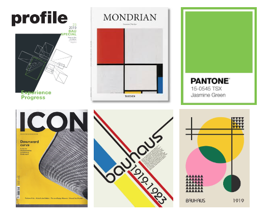

### Colours
Our colour palette is carefully selected to evoke the emotions and feelings associated with our brand. Vibrant yet harmonious colors create a visually appealing experience while maintaining readability and accessibility for all users.

- **Colour Palette**
The colour palette for this site was devised inkeeping with the Colourway logo and created in [Adobe Color](https://color.adobe.com/).

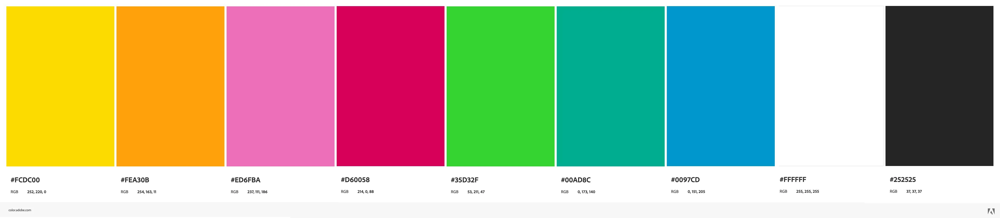

- **Logo**
The Colourway logo for this site was created in Adobe Illustrator/Photoshop and a starting point for the overall lookk of the website.

### Typography
The typography choices on our website reflect our commitment to clarity and elegance. We've selected fonts that are easy to read yet stylish, enhancing the overall aesthetic and user experience.

- **Fonts**
The fonts for this site were carefully chosen and imported from [Google Fonts](https://fonts.google.com/).

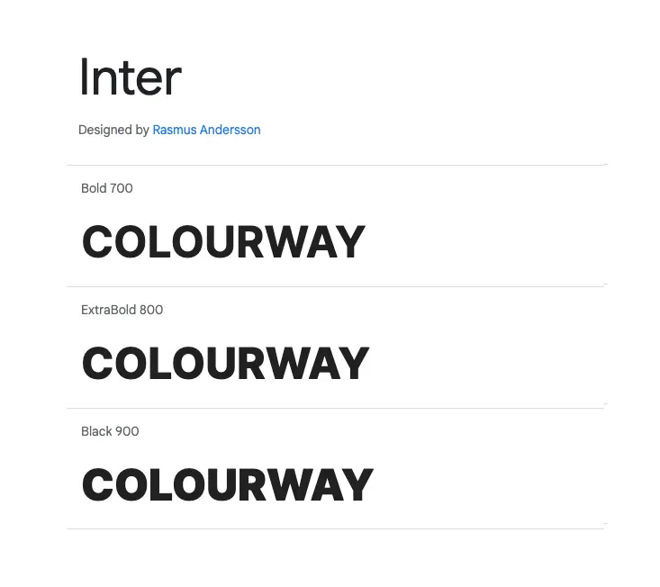
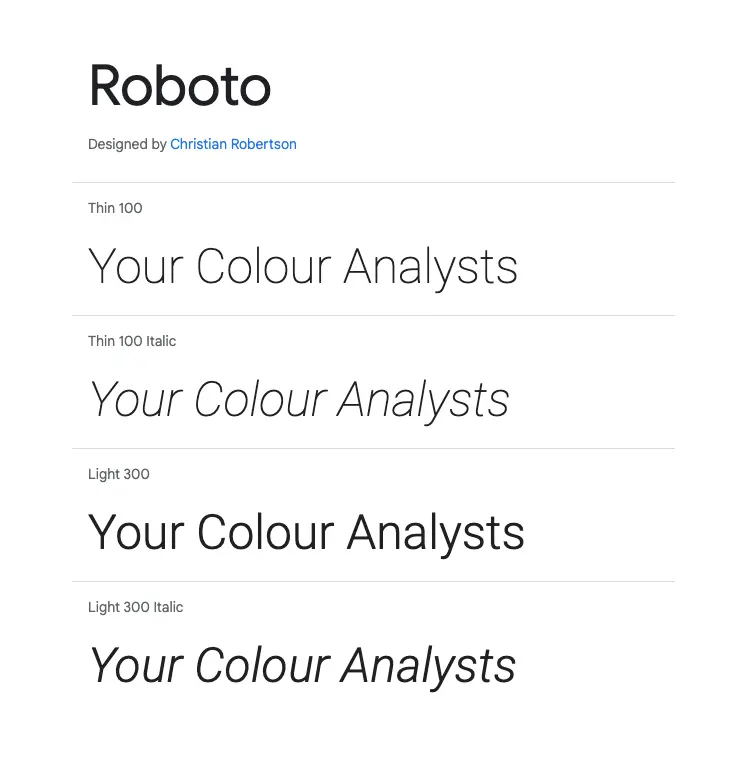

### Imagery
We believe in the power of imagery to tell a story and evoke emotions. From striking photographs to subtle background textures, every image on our website is carefully chosen to complement our content and reinforce our brand identity.

- **Hero Image**
Hero image designed by me in Adobe Illustrator and Photoshop to be bright and inviting and carry on ethos of logo and brand.

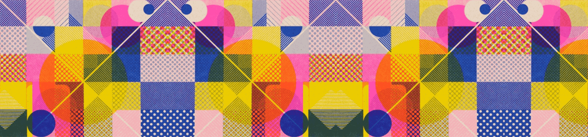

- **Content Images**
The images for content were chosen from [Pexels](https://www.pexels.com/) with the company in mind and using colours that sit well within the page. All images were optimised and converted to webp with [Convertio](https://convertio.co/).

### Wireframes
Wireframes serve as the blueprint for our website, outlining the layout and functionality of each page. They help us visualise the user experience and iterate on design concepts before implementation. 

Wireframes for this site were created with [Balsamiq](https://balsamiq.com/).

- **Index Page Wireframes**

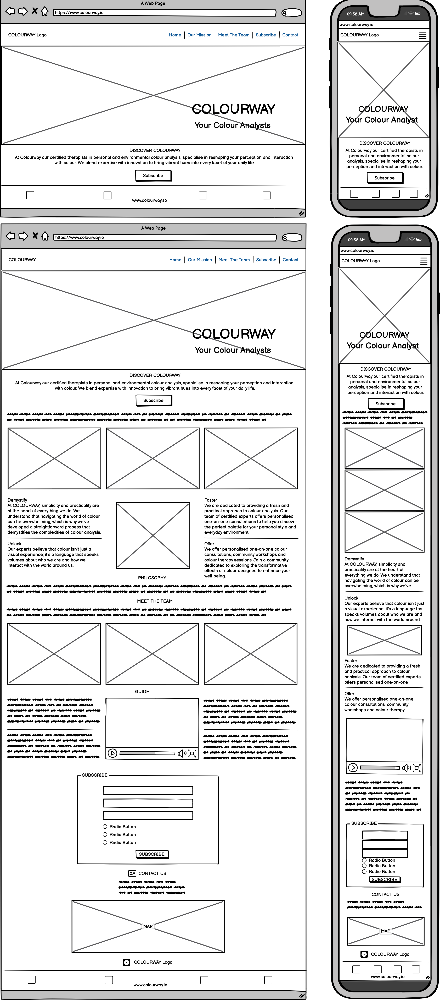

- **Subscribed Page Wireframes**

## Colurway and the 5 Elements of UX

1. **Strategy**
- Conduct research to understand the needs and preferences of the target audience regarding color analysis and aesthetics.
- Analyse competitors' websites and UX strategies to identify strengths, weaknesses, and opportunities for differentiation.
- Define the primary goals of the Colourway website, such as educating users about color theory, fostering a community, and promoting workshops/events.

2. **Scope**
- Determine the essential features and functionalities required to achieve the defined goals within the project timeline and budget.
- Outline the types of content to be included on the website, such as articles, videos, workshops, and community forums.
- Select the appropriate technologies and platforms for website development, ensuring compatibility with desired features and user experience standards.

3. **Structure**
- Information Architecture: Organize website content into logical categories and hierarchies to facilitate navigation and content discovery.
- Navigation Design: Design a clear and intuitive navigation system, including menus, links, and calls-to-action, to guide users through the website effectively.
- Content Layout: Determine the layout and placement of content elements, such as text, images, and videos, to optimize readability and visual appeal.

4. **Skeleton**
- Wireframing: Create wireframes or low-fidelity mockups of key website pages to visualize the layout and functionality before proceeding to design and development.
- Prototyping: Develop interactive prototypes or high-fidelity mockups to simulate the user experience and gather feedback from stakeholders and users.
- Usability Testing: Conduct usability testing sessions with prototype users to identify usability issues, gather insights, and iterate on design improvements before final implementation.

5. **Surface**
- Visual Design: Apply the chosen color palette, typography, and imagery to create a visually appealing and cohesive design that reflects the brand identity and resonates with the target audience.
UX/UI-  Elements: Design and implement user interface elements, such as buttons, forms, and cards, with attention to detail and consistency to enhance usability and aesthetics.
- Responsive Design: Ensure that the website is responsive and adapts seamlessly to various screen sizes and devices, providing a consistent and enjoyable user experience across desktops, tablets, and smartphones.
- Accessibility: Incorporate accessibility features and best practices, such as alt text for images, keyboard navigation, and semantic HTML, to ensure that the website is inclusive and usable for all users, including those with disabilities.
- Interaction Design: Design interactive elements and animations to engage users, provide feedback, and enhance the overall user experience without compromising performance or usability.

## Features 

### Logo and Navbar

- **Logo**

Our distinctive logo and navigation bar provide a cohesive brand identity and intuitive navigation experience.
Logo designed in Illustrator and converted to webp with [Convertio](https://convertio.co/).

- **Navbar**

The navbar Navbar includes bars icon to indicate it has a dropdown menu for mobile.

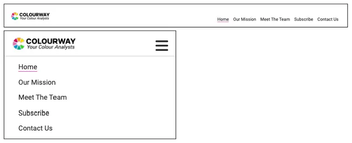

### Favicon

Designed by myself in Adobe Illustrator this custom favicon stems from the designed logo which enhances brand recognition and improves user experience by providing a visual marker for the website. 

### Headings
Clear and consistent heading styles guide users through our content, making it easy to understand and navigate.

### Main Content
### Pages
Each page on our website is designed with purpose, providing valuable information and resources to our users in a clear and accessible format.

### Subscribe Form

### Footer
Our footer design includes essential links and information, ensuring that users can access key resources from any page on our website.

## Technologies Utilised 

### Languages

- [**HTML5**](https://developer.mozilla.org/en-US/docs/Web/HTML)
- [**CSS**](https://developer.mozilla.org/en-US/docs/Web/CSS)
- [**Javascript**](https://developer.mozilla.org/en-US/docs/Learn/JavaScript)

### Frameworks and Programs

- [**Gitpod**](https://www.gitpod.io/) Gitpod was used for writing code, committing, and then pushing to GitHub. 
- [**GitHub**](https://github.com/) GitHub was utilised for hosting and viewing.
- [**Google Fonts**](https://fonts.google.com/) Google Fonts was used to import the fonts Inter and Roboto into the style.css file. These fonts were used throughout the site.
- [**Font Awesome**](https://fontawesome.com/) Font Awesome was used throughout to add icons in order to create a better visual experience for the user.
- [**Balsamiq**](https://balsamiq.com/) Balsamiq was used to create the wireframes during the design phase of the project.
- [**Responsive Design Checker**](https://responsivedesignchecker.com/) Responsive Design Checker  was used in the testing process to check responsiveness on various devices.
- [**Am I Responsive**](https://ui.dev/amiresponsive) Am I Responsive was utilised to generate Mock Up Image of site in a responsive manner.
- [**Chrome DevTools**](https://developer.chrome.com/docs/devtools) Chrome DevTools was used during development process for code review and to test responsiveness.
- [**Coolers Contrast Checker**](https://coolors.co/) Coolers Contrast Checker was used to make sure the colors I used contrasted well enough for all users
- [**Adobe Colors**](https://color.adobe.com/) Adobe Colors was used to generate a pleasing colour palette inkeeping with logo and design.
- [**Convertio**](https://convertio.co/) Convertio was utilised to optimise images to webp for faster loading

## Deployment 

Git was used for version control. Version control was done locally and remotely. For remote version control, GitHub was used. Regular commits were made after each file change.

### Remote Deployment
GitHub Pages was used to deploy the site remotely.

1. Login to [Git Hub](https://github.com/) Repository account
2. Navigate to my project repository colourway
3. Click the Settings near the top of the page
4. In the left-hand menu, find and click on the Pages
5. In the Source section, choose 'main' from the drop-down, select branch menu
6. Select 'root' from the drop-down folder menu
7. Click 'Save'
8. Project now live and a link is visible at the top of the page "Your site is published at https://github.com/sarahmclo/colourway/" 

### Local Deployment

To contribute or check the code, you can:
- Fork the repository
- Clone the repository

### How to Fork
1. To fork, go the repository
2. Click on the Fork button in the top left corner of the page
3. Fill in the form with either keep the name or create a new name for the repository

### How to Clone
1. To clone, go to repository
2. Click on the Code button above the repository files
3. A drop-down will appear and choose either
4. Go to your terminal and decide where you want to clone the files
5. Use the copy/paste button and copy it into your terminal
6. You also have the option to download a ZIP file of the code

## Testing 

### Validation Testing
### HTML

- **Index Page**

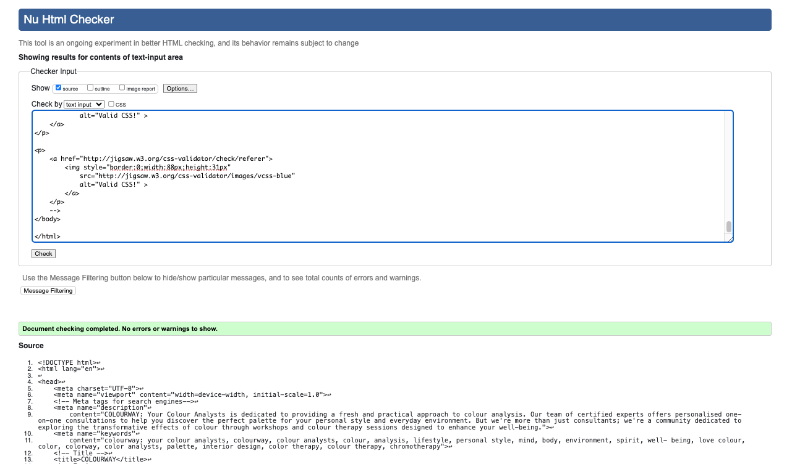

- **Subscribed Page**

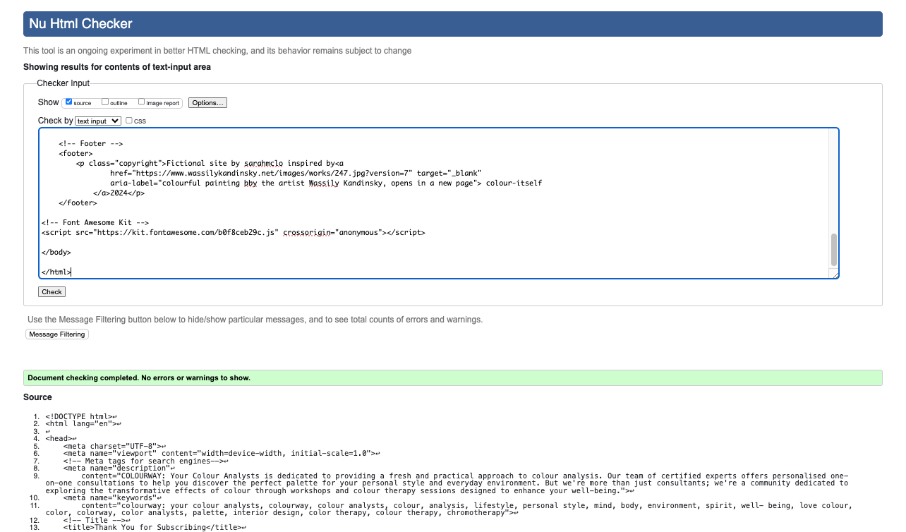

### CSS

- **Stylesheet**

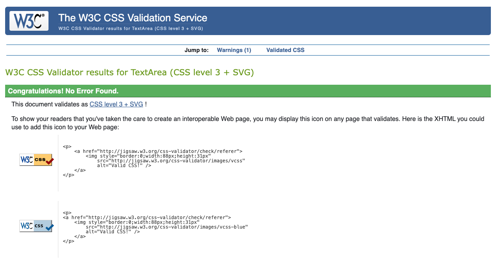

### Accessibility

### Lighthouse Testing

- **Index Page**

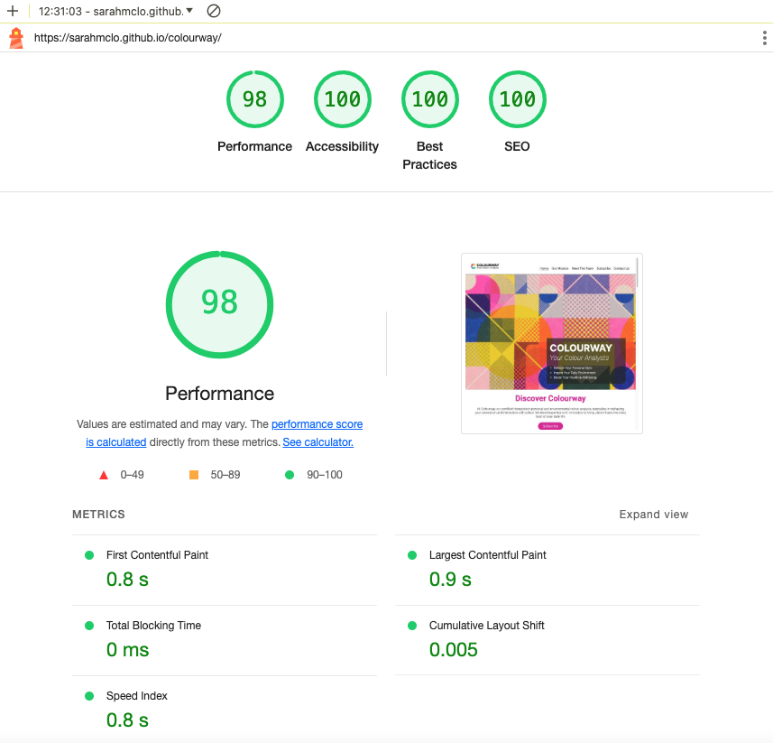

- **Subscribed Page**

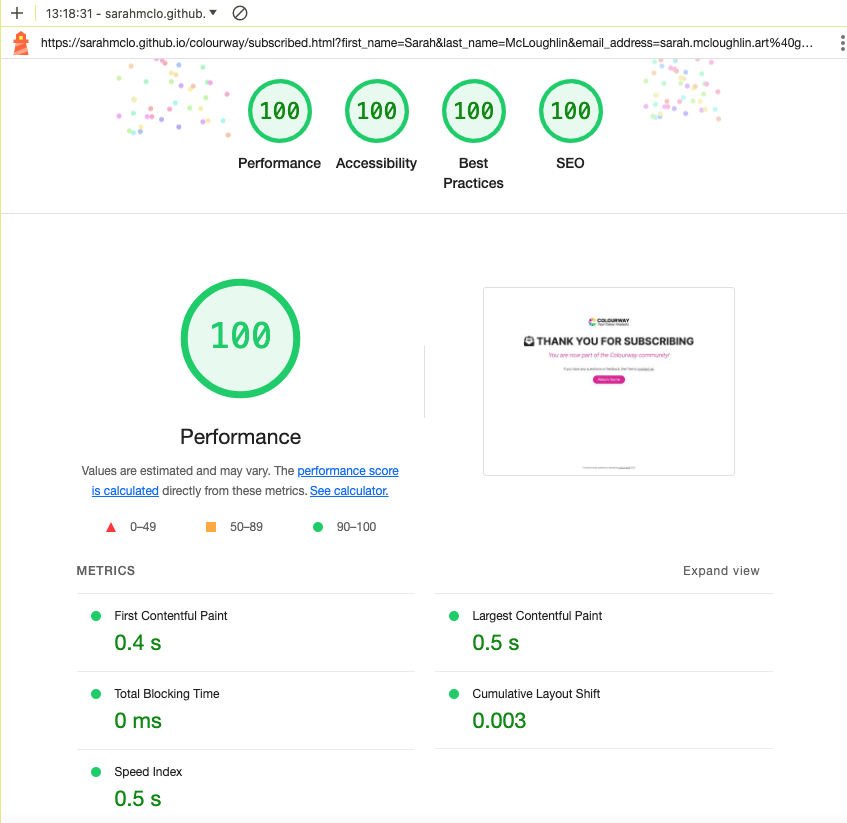

### Semantic HTML

Semantic HTML tags were used to provide a clear and meaningful structure to the website content. This helps screen readers and other assistive technologies interpret and convey information accurately.

### ARIA (Accessible Rich Internet Applications)

ARIA attributes were utilised on links to enhance the accessibility of the site allowing for screen readers to accurately pick up information.

### Contrast and Readability

Coolers Contrast Checker was used to ensure sufficient contrast in colors chosen to make the content readable for users with visual impairments.

### Alt Text for Images

All images on the website include descriptive alternative text (alt text). This helps users with visual impairments understand the content and context of images even if they cannot see them.

### Responsive Design

The website is responsive, providing a seamless experience across various devices and screen sizes. This benefits users with different abilities and ensures a consistent and accessible user experience. Tested via Chrome DevTools and Responsive Design Checker as project progressed.

### Manual Testing

Manual testing for the site involves hands-on evaluation by human testers to ensure functionality, usability, and compatibility across various devices and browsers.

## Bugs 

Throughout the development process, we encountered and resolved various bugs to ensure a smooth and seamless user experience. Our rigorous testing procedures helped identify and address these issues promptly.

- ### Mark-up Validation Testing Bugs

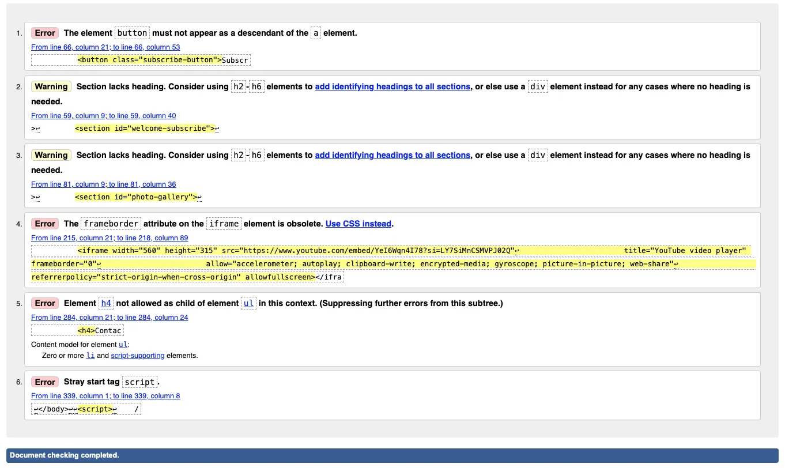

- ### All Mark-up Validation Bugs resolved

|Bug / Errors | Where / Location site | Browser | Device | Fixed | Solution |
|-------------|-----------------------|---------|--------|:-----:|----------|
| Warning: The element: button; must not appear as a descendant of the a; element| Welcome & Subscribe Section (line 56) | Chrome | Apple MacBook | Yes | Div container for button so as not inside a tag |
| Warning: Section lacks heading. Consider using h2 - h6 elements to add identifying headings to all sections | Welcome & subscribe section | Chrome | Apple MacBook (line 59) | Yes | Use h2 for heading |
| Warning: Section lacks heading. Consider using h2 - h6 elements to add identifying headings to all sections | Photo-gallery section (line 81) | Chrome | Apple MacBook | Yes | Use h2 for heading |
| Error: Frameborder attribute on iframe is obsolete | Map section (line 215) | Chrome | Apple MacBook | Yes | Remove obsolete attribute and fixed in css |
| Error: Element h4 is not allowed as child element of ul | Contact section (line 284) | Chrome | Apple MacBook | Yes | Remove heading from ul |
| Error: Stray script tag | Below body (Line 339) | Chrome | Apple MacBook | Yes | Insert script code inside body |

- ### Lighthouse Testing Bugs ###

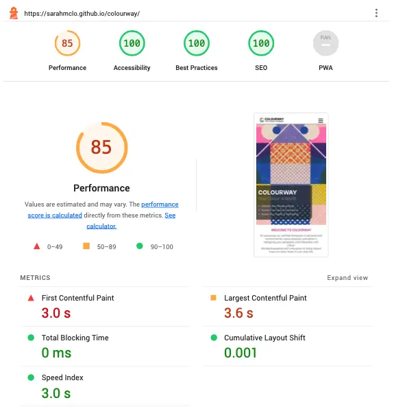

- ### One Lighthouse Bug Unresolved - Largest Contentful Paint affects Performance ###

|Bug / Errors | Where / Location site | Browser | Device | Fixed | Solution |
|-------------|-----------------------|---------|--------|:-----:|----------|
| Largest Contentful Paint element — 8,870 ms| Hero image & text section | Chrome | Apple MacBook | No | Reduce image size neumerous times but not fixed to full capacity |
| Reduce unused CSS — Potential savings of 20 KiB | CSS Stylesheet | Chrome | Apple MacBook | Yes | Refactored code in css stylesheet |
| Image elements do not have explicit width and height | Logo section | Chrome | Apple MacBook | Yes | Fix logo with specific dimensions |
| Minimize third-party usage | Colour Theory video section | Chrome | Apple MacBook | Yes | Used mp4 video rather than linking to external site|

- ### CSS Validation Testing Bugs ###

- **Google Styles Error**

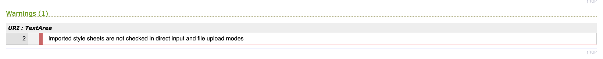

## Finished Product 

Our finished product is a testament to our dedication to providing a beautiful and functional design that showcases the transformative power of colour. From the intuitive user experience to the vibrant visual identity, every aspect of our website reflects our commitment to excellence.

Index Page Desktop

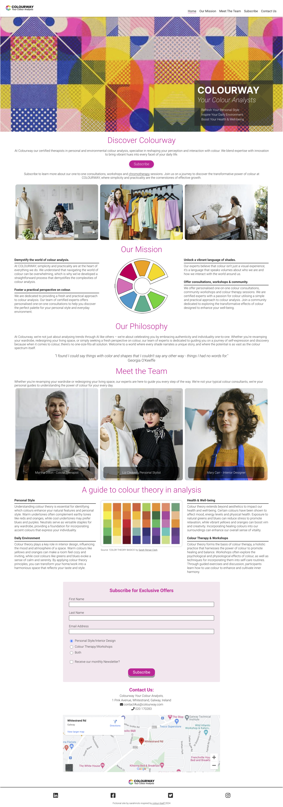

Index Page Mobile

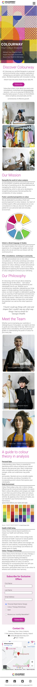

Index Page iPad

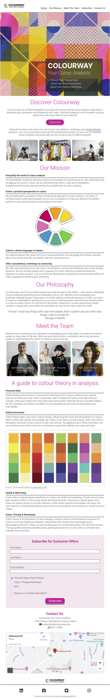

Subscribed Page Desktop

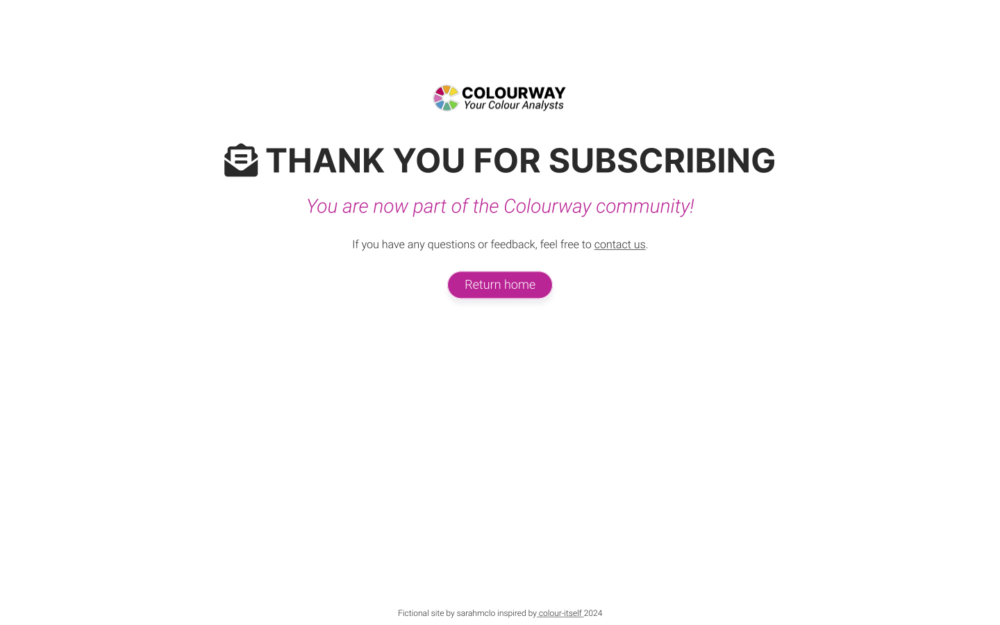

Subscribed Page Mobile

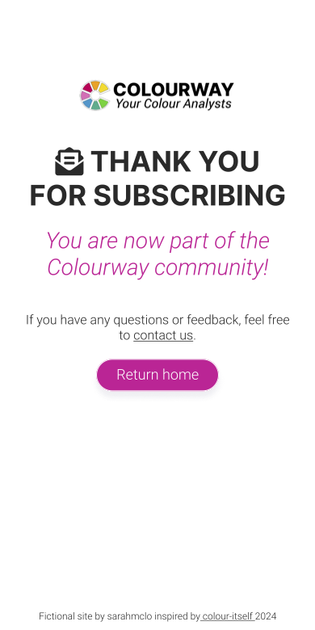

## Future Features 

* Further content linked from Meet The Team section indicating what each person offers the user in terms of consultations.
* More content exploring the nature of the seminars, workshops and newsletter.
* Introduce a testimonial/reviews section by previous users.
* Add javascript to logo palette element in mission section so than it spins and attracts the users attention.
* Introduce a forum where users can interact with like-minded individuals.
* Explore the possibility of paid partnerships with influencers to further the reach of the site and brand.

## Credits 

### Content
* All text content written by myself for a fictional company and devised for educational purposes only.
* [Code-Institute](https://codeinstitute.net/ie/?nab=0) Walkthrough projects content.
* [MDN](https://developer.mozilla.org/en-US/) Web docs and tutorials.
* [StackOverflow](https://stackoverflow.com/) Troubleshooting code.
* [W3Schools](https://www.w3schools.com/) Javascript intro tutorials for navbar menu.
* [CSS Tricks - HTML Picture](https://css-tricks.com) Further CSS tutorials.
* [Web Dev - Browser level image lazy loading](https://web.dev/browser-level-image-lazy-loading/) Lazy load images after testing.
* [Flexbox](https://css-tricks.com/snippets/css/a-guide-to-flexbox/) Flexbox tutorials.
* [Codu](https://www.codu.co/) Inspiration.

### Frameworks
* [Gitpod](https://www.gitpod.io/) Write, commit and push code to GitHub. 
* [GitHub](https://github.com/) Utilise for hosting, amending and viewing.
* [Google Fonts](https://fonts.google.com/) Import fonts.
* [Balsamiq](https://balsamiq.com/) Create the wireframes in design phase.
* [Responsive Design Checker](https://responsivedesignchecker.com/) Test responsiveness on various devices.
* [Am I Responsive](https://ui.dev/amiresponsive) Generate Mock Up Image of site in a responsive manner.
* [Chrome DevTools](https://developer.chrome.com/docs/devtools) Utilise regularly development for code review and to test responsiveness.
* [Coolers Contrast Checker](https://coolors.co/) Ensure colour contrast inline with guidelines.
* [Adobe Colors](https://color.adobe.com/) Generate pleasing colour palette inkeeping with logo and design.

### Media
* [Pexels](https://www.pexels.com/) Fictional team and company images.
* [FontAwesome](https://fontawesome.com/) Icons for navbar menu, contact section and social networks.
* [Favicon](https://favicon.io/) Created my own favicon with logo of page.
* [Convertio](https://convertio.co/document-converter/) Images converted to webp for optimal loading.
* [Colour Theory Basics by Sarah Renae Clark](https://www.youtube.com/watch?v=YeI6Wqn4I78) Video content on colour theory.
* [GoogleMaps](https://www.google.com/maps) Fictional location for company.

## Conclusion 
At COLOURWAY: Your Colour Analysts, we believe that design should be both beautiful and functional. Our website is a testament to this belief, offering a simple, practical, and bold user experience that puts the transformative power of colour at your fingertips. Join us on a journey to discover the true impact of colour in your life. Welcome to a world where every shade narrates a unique story, and where the potential is as vast as the colour spectrum itself.

## Acknowledgements 
 
- Rahul Lakahanpal, my Code Institute mentor, for encouragement, keeping me on track and advising me what is important and when to move on!
- Amy Richardson, my Code Institute Facillitator, for amazing resources, motivation and keeping me focused.
- Code Institute Tutor Support and Student Care.
- All in the CI Slack community for resources and daily inspiration.
- Fellow course students for sharing.
- Family and Ozzy the dog for their eyes, ears, thoughts and testing.