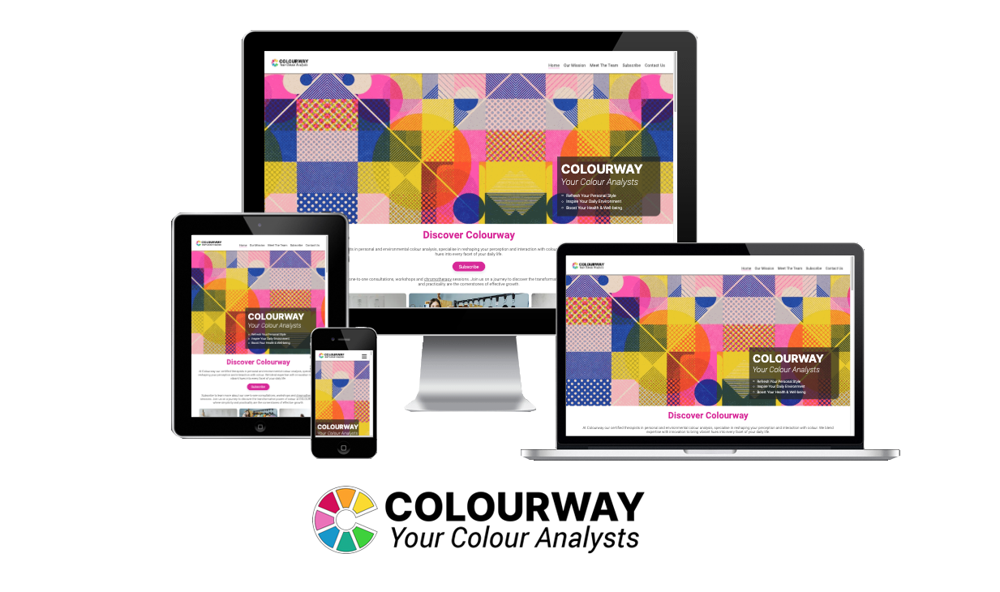
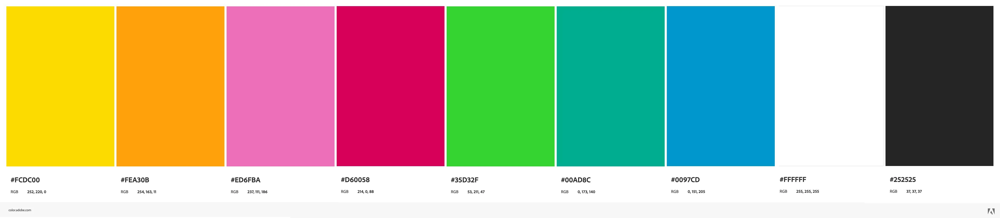
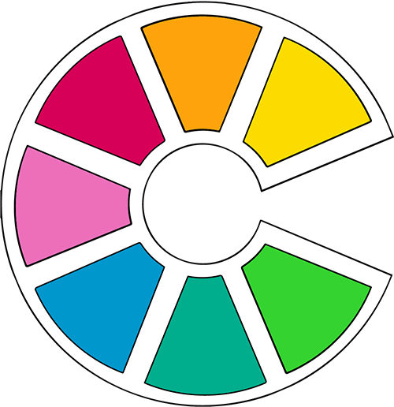
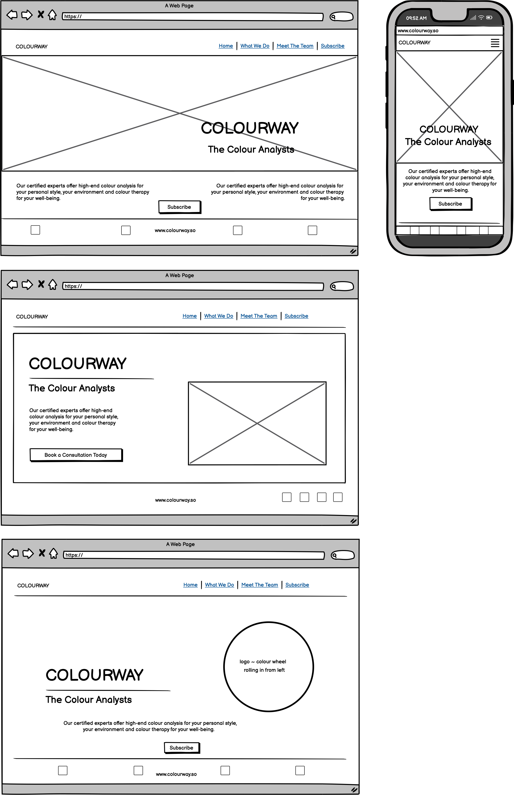
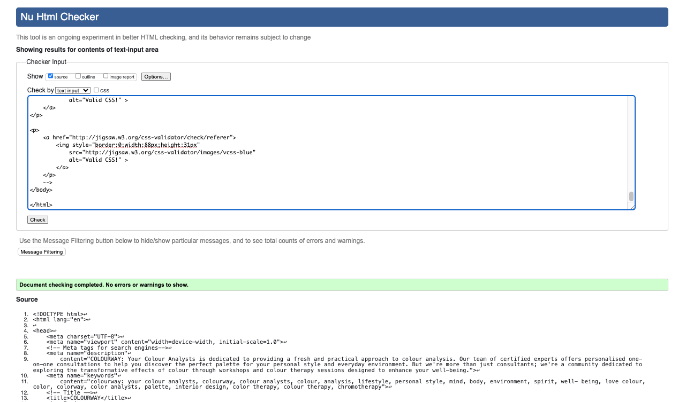
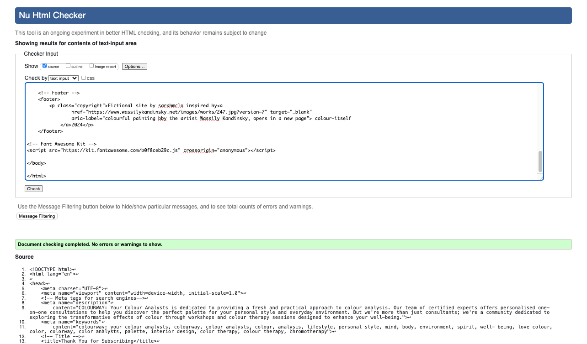
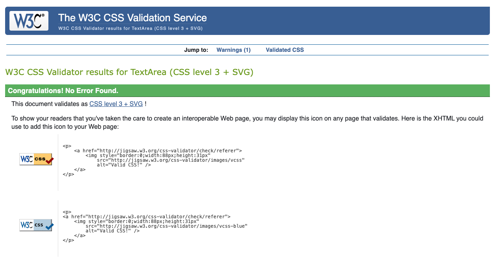
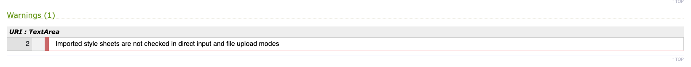
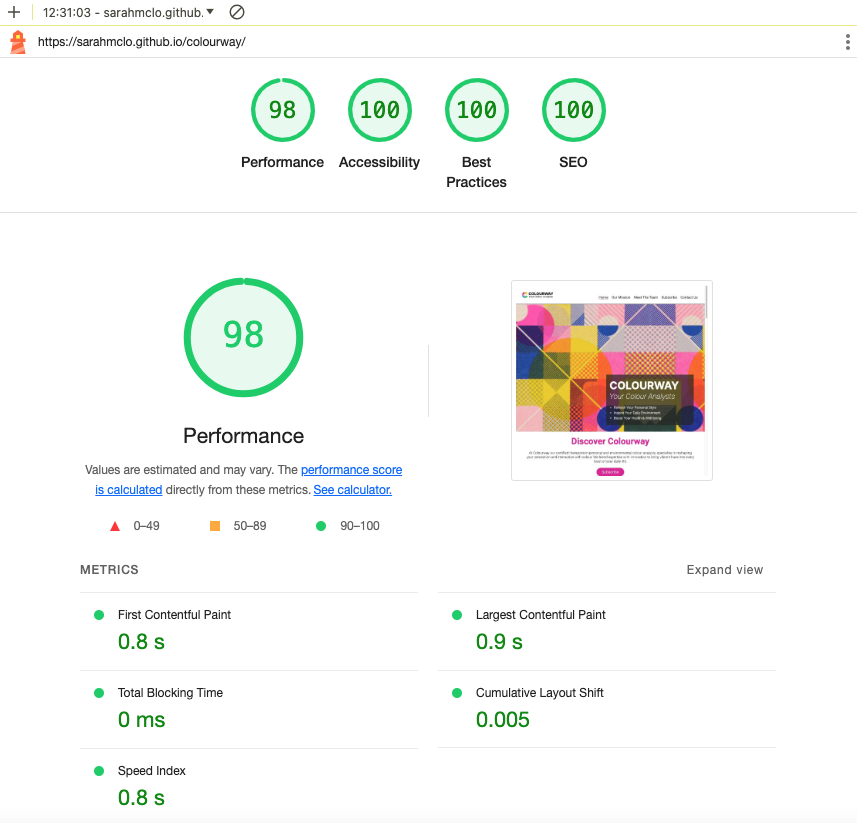
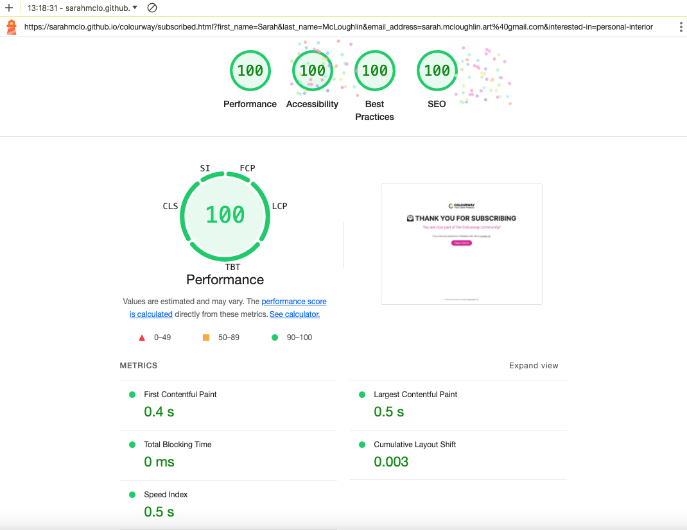

# Colourway, *Your Colour Analysts*

Welcome to COLOURWAY, Your Colour Analysts, where we believe that colour isn't just a visual experience; it's a language that speaks volumes about who we are and how we interact with the world around us. We're not your typical colour consultants – we're your personal guides to understanding the power of colour in your life. 

With this site we offer a clean, practical, and user-friendly platform for individuals to explore the transformative power of colour and integrate it into their daily routines in meaningful ways. We believe that simplicity and practicality are the cornerstones of effective design, our website is a testament to this philosophy, offering a bold and intuitive user experience that puts the transformative power of colour front and centre in a personal yet practical way. Our website calls on our user to subcribe to the COLOURWAY community for exclusive info and offers.

[View Colourway Live Here](https://sarahmclo.github.io/colourway/)

## Table of Contents

## About Us
COLOURWAY: Your Colour Analysts is dedicated to providing a fresh and practical approach to colour analysis. Our team of certified experts offers personalised one-on-one consultations to help you discover the perfect palette for your personal style and everyday environment. But we're more than just consultants; we're a community dedicated to exploring the transformative effects of colour through workshops and colour therapy sessions designed to enhance your well-being.

- Our Approach

At COLOURWAY, simplicity and practicality are at the heart of everything we do. We understand that navigating the world of colour can be overwhelming, which is why we've developed a straightforward process that demystifies the complexities of colour analysis. Whether you're revamping your wardrobe or redesigning your living space, our experts are here to guide you every step of the way.

- What We Offer

1 Personalised one-on-one colour consultations
2 Community workshops and colour therapy sessions
3 Certified experts with a passion for colour
4 Simple and practical approach to colour analysis

## User Experience (UX)
When you visit our website, you'll immediately notice the simplicity of our design. We've eschewed unnecessary clutter in favour of clean, uncluttered layouts that allow our content to shine. Whether you're browsing our services or exploring our community events, you'll find that everything is just a click away, thanks to our intuitive navigation system.
The 5 S's

### Intended Audience

### Project Goals

### User stories
- Target Audience Goals
- First Time Visitor Goals
- Return Visitor Goals
- Frequent Visitor Goals

## Design

### Design Philosophy

Our design ethos is rooted in the idea that less is more. We've embraced clean lines, minimalist layouts, and bold colour choices to create an interface that is both visually striking and easy to navigate. Every element has been carefully considered to ensure a seamless user experience, from the intuitive navigation menu to the vibrant colour palettes that adorn each page.

### Design Choices

While our design may be simple, that doesn't mean it's lacking in impact. We've made bold choices in our use of colour and typography to create a website that stands out from the crowd. Vibrant hues and eye-catching fonts draw the user's attention and create a memorable visual identity for our brand.

### Colours
Our colour palette is carefully selected to evoke the emotions and feelings associated with our brand. Vibrant yet harmonious colors create a visually appealing experience while maintaining readability and accessibility for all users.

### Typography/Fonts
The typography choices on our website reflect our commitment to clarity and elegance. We've selected fonts that are easy to read yet stylish, enhancing the overall aesthetic and user experience.

### Imagery
We believe in the power of imagery to tell a story and evoke emotions. From striking photographs to subtle background textures, every image on our website is carefully chosen to complement our content and reinforce our brand identity.

### Structure
Our website's structure is designed to guide users seamlessly through their journey, from discovering our services to engaging with our community events. Clear navigation and intuitive layout ensure that users can find what they need quickly and easily.

### Wireframes
Wireframes serve as the blueprint for our website, outlining the layout and functionality of each page. They help us visualise the user experience and iterate on design concepts before implementation

## Features

### Logo and Navbar
Designed logo and converted to webp

Our distinctive logo and navigation bar provide a cohesive brand identity and intuitive navigation experience.

### Favicon
Designed by myself in photoshop this custom favicon stems from the designed logo which enhances brand recognition and improves user experience by providing a visual marker for the website. 

### Headings
Clear and consistent heading styles guide users through our content, making it easy to understand and navigate.

### Footer
Our footer design includes essential links and information, ensuring that users can access key resources from any page on our website.

### Pages
Each page on our website is designed with purpose, providing valuable information and resources to our users in a clear and accessible format.

## Technologies Used

### Languages
The languages used in this project are:
HTML
CSS
Javascript

### Frameworks and Programs Used

### Codeanywhere

Codeanywhere was used for writing code, committing, and then pushing to GitHub. GitHub

### Google Fonts

Google Fonts was used to import the fonts Barlow Condensed into the style.css file. These fonts were used throughout the site.

### Font Awesome

Font Awesome was used throughout all pages to add icons in order to create a better visual experience for User experience purposes.

### Balsamiq

Balsamiq was used to create the wireframes during the design phase of the project.

### Multi Device Website Mockup Generator

Responsive Design Checker was used in the testing process to check responsiveness on various devices and to generate mockup image.

### Chrome DevTools

Chrome DevTools was used during development process for code review and to test responsiveness.

### Coolers Contrast Checker

Coolers Contrast Checker was used to make sure the colors I used contrasted well enough for all users

### Languages
The languages used in this project are:
HTML
CSS
Javascript

## Testing

### Validator Testing
### HTML
Index Page

Subscribed Page

### CSS
Colourway Stylesheet

Google Styles Error

### Lighthouse
Index Page

Subscribed Page

### Accessibility

1. Lighthouse testing

2. Semantic HTML

Semantic HTML tags were used to provide a clear and meaningful structure to the website content. This helps screen readers and other assistive technologies interpret and convey information accurately.

3. ARIA (Accessible Rich Internet Applications)
ARIA attributes were utilised on links to enhance the accessibility of the site allowing for screen readers to accurately pick up information.

4. Contrast and Readability
Coolers Contrast Checker was used to ensure sufficient contrast in colors chosen to make the content readable for users with visual impairments.

5. Alt Text for Images
All images on the website include descriptive alternative text (alt text). This helps users with visual impairments understand the content and context of images even if they cannot see them.

6. Responsive Design
The website is responsive, providing a seamless experience across various devices and screen sizes. This benefits users with different abilities and ensures a consistent and accessible user experience.

This was tested via Chrome DevTools as the project progressed.

### Manual Testing

### Common Elements

### Performance

### Browser Compatibilty

## Remote & Local Deployment
Git was used for version control. Version control was done locally and remotely. For remote version control, GitHub was used. Regular commits were made after each file change.

### Remote Deployment
GitHub Pages was used to deploy the site remotely.

1. Login to [Git Hub](https://github.com/) Repository account
2. Navigate to my project repository colourway
3. Click the Settings near the top of the page
4. In the left-hand menu, find and click on the Pages
5. In the Source section, choose 'main' from the drop-down, select branch menu
6. Select 'root' from the drop-down folder menu
7. Click 'Save'
8. Project now live and a link is visible at the top of the page "Your site is published at https://github.com/sarahmclo/colourway/" 

### Local Deployment
To contribute or check the code, you can:

- Fork the repository
- Clone the repository

### How to Fork
1 To fork, go the repository
2 Click on the Fork button in the top left corner of the page
3 Fill in the form with either keep the name or create a new name for the repository

### How to Clone
1 To clone, go to repository
2 Click on the Code button above the repository files
3 A drop-down will appear and choose either
4 Go to your terminal and decide where you want to clone the files
5 Use the copy/paste button and copy it into your terminal
6 You also have the option to download a ZIP file of the code

## Finished Product
Our finished product is a testament to our dedication to providing a beautiful and functional design that showcases the transformative power of colour. From the intuitive user experience to the vibrant visual identity, every aspect of our website reflects our commitment to excellence.

## Bugs
Throughout the development process, we encountered and resolved various bugs to ensure a smooth and seamless user experience. Our rigorous testing procedures helped identify and address these issues promptly.

## Credits

### Content
All content written for the website is by myself, is purely fictional, and for educational purposes only.

### Media

### Code

### Conclusion
At COLOURWAY: Your Colour Analysts, we believe that design should be both beautiful and functional. Our website is a testament to this belief, offering a simple, practical, and bold user experience that puts the transformative power of colour at your fingertips. Join us on a journey to discover the true impact of colour in your life. Welcome to a world where every shade narrates a unique story, and where the potential is as vast as the colour spectrum itself.

## Acknowledgements
