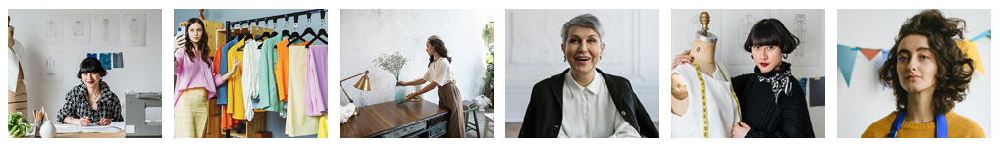

# Colourway *Your Colour Analysts*

Welcome to COLOURWAY, Your Colour Analysts. With this site we offer a clean, practical, and user-friendly platform for individuals to explore the transformative power of colour and integrate it into their daily routines in meaningful ways. We believe that simplicity and practicality are the cornerstones of effective design, our website is a testament to this philosophy, offering a bold and intuitive user experience that puts the transformative power of colour front and centre in a personal yet practical way. Our website calls on our user to subscribe to the COLOURWAY community for exclusive information and offers.

[View Colourway Live Here](https://sarahmclo.github.io/colourway/)

## Table of Contents
1. [User Experience (UX)](#user-experience)
    - [Project Goals](#project-goals)
    - [User stories](#user-stories)
    - [Target Audience Goals](#target-audience-goals)
    - [Site Owner Goals](#site-owner-goals)
    - [First Time User Goals](#first-time-user-goals)
    - [Return User Goals](#return-user-goals)
2. [Design](#design)
    - [Design Philosophy](#design-philosophy)
    - [Design Choices](#design-choices)
    - [Colours](#colours)
    - [Typography](#typography)
    - [Imagery](#imagery)
    - [Structure](#structure)
    - [Wireframes](#wireframes)
3. [Features](#features)
    - [Logo and Navbar](#logo-and-navbar)
    - [Favicon](#favicon)
    - [Headings](#headings)
    - [Main Content](#main-content)
    - [Footer](#footer)
    - [Pages](#pages)
4. [Technologies Utilised](#technologies-utilised)
    - [Languages](#languages)
    - [Frameworks and Programs](#frameworks-and-programs)
5. [Testing](#testing)
    - [Validation Testing](#validation-testing)
    - [Manual Testing](#manual-testing)
    - [Common Elements](#common-elements)
    - [Performance](#performance)
    - [Browser Compatibility](#browser-compatibility)
6. [Deployment](#deployment)
    - [Remote Deployment](#remote-deployment)
    - [Local Deployment](#local-deployment)
7. [Finished Product](#finished-product)
8. [Future Features](#future-features)
9. [Bugs](#bugs)
10. [Credits](#credits)
    - [Content](#content)
    - [Media](#media)
    - [Code](#code)
11. [Conclusion](#conclusion)
12. [Acknowledgements](#acknowledgements)

## User Experience (UX)
When you visit our website, you'll immediately notice the simplicity of our design. We've eschewed unnecessary clutter in favour of clean, uncluttered layouts that allow our content to shine. Whether you're browsing our services or exploring our community events, you'll find that everything is just a click away, thanks to our intuitive navigation system.

### Project Goals

### User stories

### Target Audience Goals

### Site Owner Goals

### First Time User Goals

### Return User Goals

## Design 

### Design Philosophy
Our design ethos is rooted in the idea that less is more. We've embraced clean lines, minimalist layouts, and bold colour choices to create an interface that is both visually striking and easy to navigate. Every element has been carefully considered to ensure a seamless user experience, from the intuitive navigation menu to the vibrant colour palettes that adorn each page.

### Design Choices
While our design may be simple, that doesn't mean it's lacking in impact. We've made bold choices in our use of colour and typography to create a website that stands out from the crowd. Vibrant hues and eye-catching fonts draw the user's attention and create a memorable visual identity for our brand.

- **Reference Images**
Strong lines, simple shapes with a nod to the Bauhaus movement are our inspiration as seen in the reference imagery below.

### Colours
Our colour palette is carefully selected to evoke the emotions and feelings associated with our brand. Vibrant yet harmonious colors create a visually appealing experience while maintaining readability and accessibility for all users.

- **Colour Palette**
The colour palette for this site was devised inkeeping with the Colourway logo and created in [Adobe Color](https://color.adobe.com/).

- **Logo**
The Colourway logo for this site was created in Adobe Illustrator/Photoshop and a starting point for the overall lookk of the website.

### Typography
The typography choices on our website reflect our commitment to clarity and elegance. We've selected fonts that are easy to read yet stylish, enhancing the overall aesthetic and user experience.

- **Fonts**
The fonts for this site were carefully chosen and imported from [Google Fonts](https://fonts.google.com/).

### Imagery
We believe in the power of imagery to tell a story and evoke emotions. From striking photographs to subtle background textures, every image on our website is carefully chosen to complement our content and reinforce our brand identity.

- **Hero Image**
Hero image designed by me in Adobe Illustrator and Photoshop to be bright and inviting and carry on ethos of logo and brand.

- **Content Images**
The images for content were chosen from [Pexels](https://www.pexels.com/) with the company in mind and using colours that sit well within the page. All images were optimised and converted to webp with [Convertio](https://convertio.co/).

### Wireframes
Wireframes serve as the blueprint for our website, outlining the layout and functionality of each page. They help us visualise the user experience and iterate on design concepts before implementation. 

Wireframes for this site were created with [Balsamiq](https://balsamiq.com/).

- **Index Page Wireframes**

- **Subscribed Page Wireframes**

## Colurway and the 5 Elements of UX

1. **Strategy**

2. **Scope**

3. **Structure**

4. **Skeleton**

5. **Surface**

## Features 

### Logo and Navbar

- **Logo**

Our distinctive logo and navigation bar provide a cohesive brand identity and intuitive navigation experience.
Logo designed in Illustrator and converted to webp with [Convertio](https://convertio.co/).

- **Navbar**

The navbar Navbar includes bars icon to indicate it has a dropdown menu for mobile.

### Favicon

Designed by myself in Adobe Illustrator this custom favicon stems from the designed logo which enhances brand recognition and improves user experience by providing a visual marker for the website. 

### Headings
Clear and consistent heading styles guide users through our content, making it easy to understand and navigate.

### Main Content
### Pages
Each page on our website is designed with purpose, providing valuable information and resources to our users in a clear and accessible format.

### Subscribe Form

### Footer
Our footer design includes essential links and information, ensuring that users can access key resources from any page on our website.

## Technologies Utilised 

### Languages
The languages used in this project are:
HTML5
CSS
Javascript

### Frameworks and Programs

### [Gitpod](https://www.gitpod.io/)

Gitpod was used for writing code, committing, and then pushing to GitHub. 

### [GitHub](https://github.com/)

GitHub was utilised for hosting and viewing.

### [Google Fonts](https://fonts.google.com/)

Google Fonts was used to import the fonts Inter and Roboto into the style.css file. These fonts were used throughout the site.

### [Font Awesome](https://fontawesome.com/)

Font Awesome was used throughout to add icons in order to create a better visual experience for the user.

### [Balsamiq](https://balsamiq.com/)

Balsamiq was used to create the wireframes during the design phase of the project.

### [Responsive Design Checker](https://responsivedesignchecker.com/)

Responsive Design Checker  was used in the testing process to check responsiveness on various devices.

### [Am I Responsive](https://ui.dev/amiresponsive)

Am I Responsive was utilised to generate Mock Up Image of site in a responsive manner.

### [Chrome DevTools](https://developer.chrome.com/docs/devtools)

Chrome DevTools was used during development process for code review and to test responsiveness.

### [Coolers Contrast Checker](https://coolors.co/)

Coolers Contrast Checker was used to make sure the colors I used contrasted well enough for all users

### [Adobe Colors](https://color.adobe.com/)
Adobe Colors was used to generate a pleasing colour palette inkeeping with logo and design.

### [Convertio](https://convertio.co/)
Convertio was utilised to optimise images to webp for faster loading

## Testing 

### Validation Testing
### HTML

- **Index Page**

- **Subscribed Page**

### CSS

- **Stylesheet**

- **Google Styles Error**

### Accessibility

### Lighthouse Testing

- **Index Page**

- **Subscribed Page**

### Semantic HTML

Semantic HTML tags were used to provide a clear and meaningful structure to the website content. This helps screen readers and other assistive technologies interpret and convey information accurately.

### ARIA (Accessible Rich Internet Applications)

ARIA attributes were utilised on links to enhance the accessibility of the site allowing for screen readers to accurately pick up information.

### Contrast and Readability

Coolers Contrast Checker was used to ensure sufficient contrast in colors chosen to make the content readable for users with visual impairments.

### Alt Text for Images

All images on the website include descriptive alternative text (alt text). This helps users with visual impairments understand the content and context of images even if they cannot see them.

### Responsive Design

The website is responsive, providing a seamless experience across various devices and screen sizes. This benefits users with different abilities and ensures a consistent and accessible user experience. Tested via Chrome DevTools and Responsive Design Checker as project progressed.

### Manual Testing

### Common Elements

### Performance

### Browser Compatibility

## Deployment 
Git was used for version control. Version control was done locally and remotely. For remote version control, GitHub was used. Regular commits were made after each file change.

### Remote Deployment
GitHub Pages was used to deploy the site remotely.

1. Login to [Git Hub](https://github.com/) Repository account
2. Navigate to my project repository colourway
3. Click the Settings near the top of the page
4. In the left-hand menu, find and click on the Pages
5. In the Source section, choose 'main' from the drop-down, select branch menu
6. Select 'root' from the drop-down folder menu
7. Click 'Save'
8. Project now live and a link is visible at the top of the page "Your site is published at https://github.com/sarahmclo/colourway/" 

### Local Deployment
To contribute or check the code, you can:
- Fork the repository
- Clone the repository

### How to Fork
1. To fork, go the repository
2. Click on the Fork button in the top left corner of the page
3. Fill in the form with either keep the name or create a new name for the repository

### How to Clone
1. To clone, go to repository
2. Click on the Code button above the repository files
3. A drop-down will appear and choose either
4. Go to your terminal and decide where you want to clone the files
5. Use the copy/paste button and copy it into your terminal
6. You also have the option to download a ZIP file of the code

## Bugs 
Throughout the development process, we encountered and resolved various bugs to ensure a smooth and seamless user experience. Our rigorous testing procedures helped identify and address these issues promptly.

## Finished Product 
Our finished product is a testament to our dedication to providing a beautiful and functional design that showcases the transformative power of colour. From the intuitive user experience to the vibrant visual identity, every aspect of our website reflects our commitment to excellence.

<h3>Index Page Desktop</h3>

<h3>Index Page Mobile</h3>

<h3>Index Page iPad</h3>

<h3>Subscribed Page Desktop</h3>

<h3>Subscribed Page Mobile</h3>

## Future Features 

## Credits 

### Content
* All text content written by myself for a fictional company and devised for educational purposes only.
* [Code-Institute](https://codeinstitute.net/ie/?nab=0) Walkthrough projects content.
* [MDN](https://developer.mozilla.org/en-US/) Web docs and tutorials.
* [StackOverflow](https://stackoverflow.com/) Troubleshooting code.
* [W3Schools](https://www.w3schools.com/) Javascript intro tutorials for navbar menu.
* [CSS Tricks - HTML Picture](https://css-tricks.com) Further CSS tutorials.
* [Web Dev - Browser level image lazy loading](https://web.dev/browser-level-image-lazy-loading/) Lazy load images after testing.
* [Flexbox](https://css-tricks.com/snippets/css/a-guide-to-flexbox/) Flexbox tutorials.
* [Codu](https://www.codu.co/) Inspiration.

### Frameworks
* [Gitpod](https://www.gitpod.io/) Write, commit and push code to GitHub. 
* [GitHub](https://github.com/) Utilise for hosting, amending and viewing.
* [Google Fonts](https://fonts.google.com/) Import fonts.
* [Balsamiq](https://balsamiq.com/) Create the wireframes in design phase.
* [Responsive Design Checker](https://responsivedesignchecker.com/) Test responsiveness on various devices.
* [Am I Responsive](https://ui.dev/amiresponsive) Generate Mock Up Image of site in a responsive manner.
* [Chrome DevTools](https://developer.chrome.com/docs/devtools) Utilise regularly development for code review and to test responsiveness.
* [Coolers Contrast Checker](https://coolors.co/) Ensure colour contrast inline with guidelines.
* [Adobe Colors](https://color.adobe.com/) Generate pleasing colour palette inkeeping with logo and design.

### Media
* [Pexels](https://www.pexels.com/) Fictional team and company images.
* [FontAwesome](https://fontawesome.com/) Icons for navbar menu, contact section and social networks.
* [Favicon](https://favicon.io/) Created my own favicon with logo of page.
* [Convertio](https://convertio.co/document-converter/) Images converted to webp for optimal loading.
* [Colour Theory Basics by Sarah Renae Clark](https://www.youtube.com/watch?v=YeI6Wqn4I78) Video content on colour theory.
* [GoogleMaps](https://www.google.com/maps) Fictional location for company.

## Conclusion 
At COLOURWAY: Your Colour Analysts, we believe that design should be both beautiful and functional. Our website is a testament to this belief, offering a simple, practical, and bold user experience that puts the transformative power of colour at your fingertips. Join us on a journey to discover the true impact of colour in your life. Welcome to a world where every shade narrates a unique story, and where the potential is as vast as the colour spectrum itself.

## Acknowledgements 
Thank you to: 
- Rahul Lakahanpal, my Code Institute mentor, for encouragement and keeping me on track.
- Amy Richardson, my Code Institute Facillitator, for motivation and keeping me focused.
- Code Institute Tutor Support and Student Care.
- All in the CI Slack community for resources and daily inspiration.
- Fellow course students for sharing.
- Family and Ozzy the dog for their eyes, ears, thoughts and testing.
