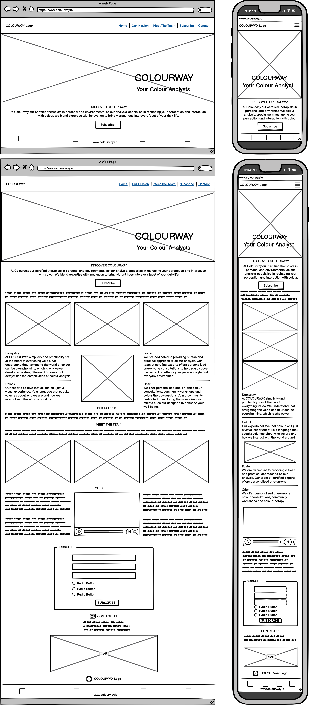
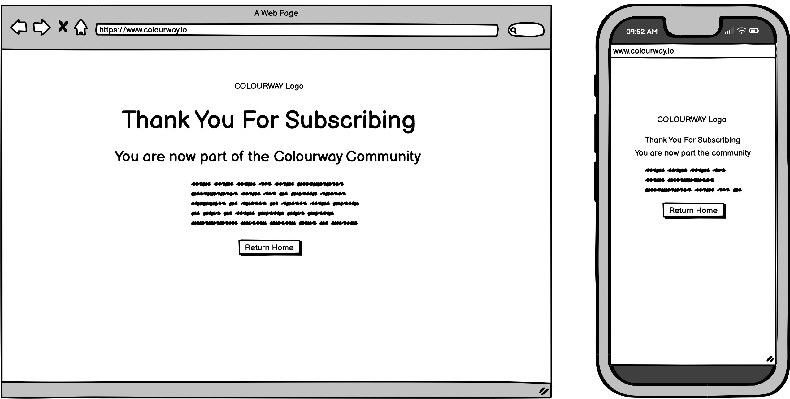
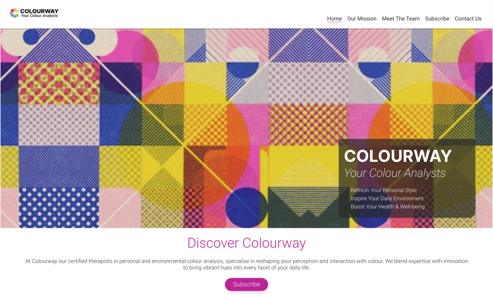
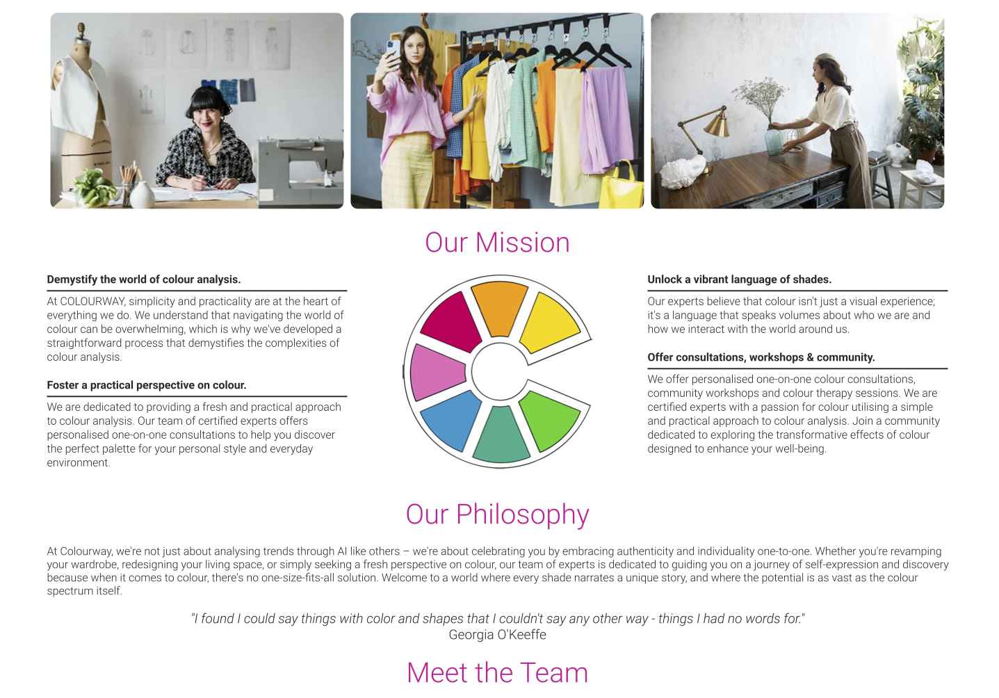
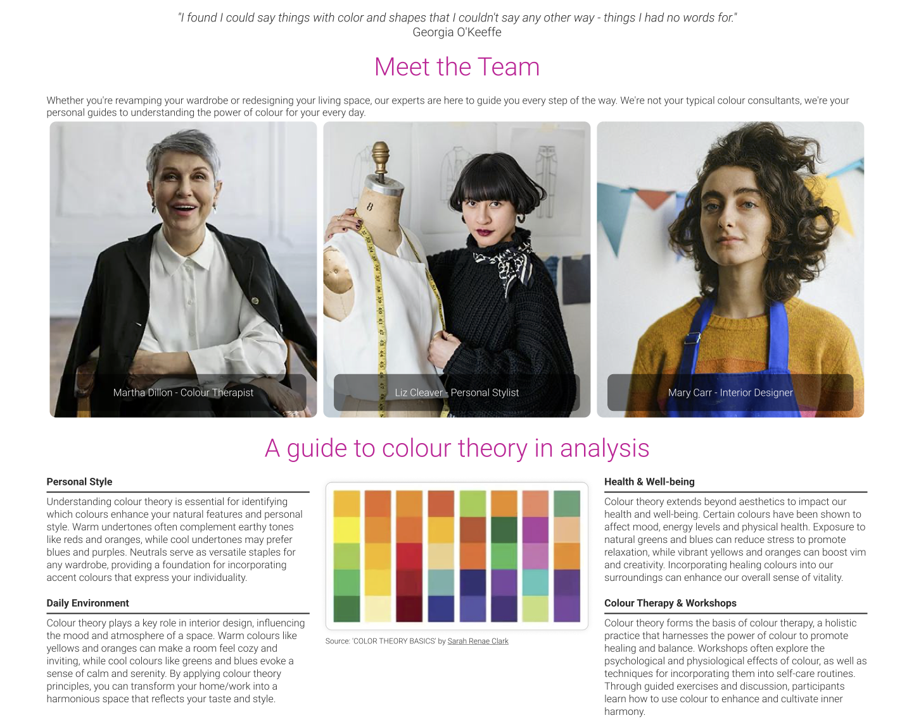
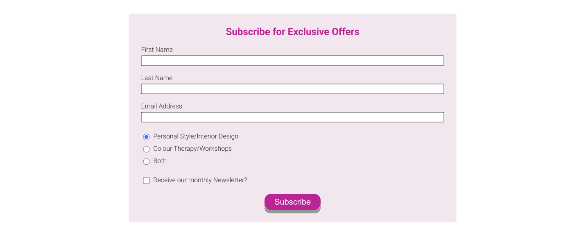
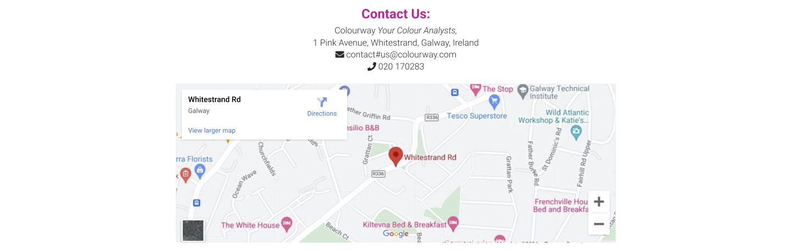

# Colourway *Your Colour Analysts*

Welcome to COLOURWAY, Your Colour Analysts. With this site we offer a clean, practical, and user-friendly platform for individuals to explore the transformative power of colour and integrate it into their daily routines in meaningful ways. We believe that simplicity and practicality are the cornerstones of effective design, our website is a testament to this philosophy, offering a bold and intuitive user experience that puts the transformative power of colour front and centre in a personal yet practical way. Our website calls on our user to subscribe to the COLOURWAY community for exclusive information and offers.

[View Colourway Live Here](https://sarahmclo.github.io/colourway/)

## Table of Contents
1. [User Experience (UX)](#user-experience)
    - [Project Goals](#project-goals)
    - [User stories](#user-stories)
    - [Target Audience Goals](#target-audience-goals)
    - [Site Owner Goals](#site-owner-goals)
    - [First Time User Goals](#first-time-user-goals)
    - [Return User Goals](#return-user-goals)
2. [Design](#design)
    - [Design Philosophy](#design-philosophy)
    - [Design Choices](#design-choices)
    - [Colour Scheme](#colour-scheme)
    - [Typography](#typography)
    - [Imagery](#imagery)
    - [Wireframes](#wireframes)
    - [Structure](#structure)
    - [The 5 Elements at COLOURWAY](#the-5-elements-at-colourway)
3. [Features](#features)
    - [Logo and Navbar](#logo-and-navbar)
    - [Favicon](#favicon)
    - [Headings](#headings)
    - [Pages](#pages)
    - [Main Content](#main-content)
    - [Subscribe Form](#subscribe-form)
    - [Contact](#contact)
    - [Footer](#footer)
4. [Technologies Utilised](#technologies-utilised)
    - [Languages](#languages)
    - [Frameworks and Programs](#frameworks-and-programs)
5. [Deployment](#deployment)
    - [Remote Deployment](#remote-deployment)
    - [Local Deployment](#local-deployment)
6. [Testing](#testing)
    - [Validation Testing](#validation-testing)
    - [Manual Testing](#manual-testing)
7. [Bugs and Fixes](#bugs-and-fixes)
8. [Finished Product](#finished-product)
9. [Future Features](#future-features)
10. [Credits](#credits)
    - [Content](#Content)
    - [Frameworks](#frameworks)
    - [Media](#media)
11. [Conclusion](#conclusion)
12. [Acknowledgements](#acknowledgements)

## User Experience (UX)

When you visit our website, you'll immediately notice the simplicity of our design. We've eschewed unnecessary clutter in favour of clean, uncluttered layouts that allow our content to shine. Whether you're browsing our services or exploring our community events, you'll find that everything is just a click away, thanks to our intuitive navigation system.

### Project Goals

- Develop a user-friendly website that emphasizes the Colourway ethos.
- Implement a clean and practical design philosophy to enhance user experience.
- Ensure the website is responsive across all devices.
- Prioritize simplicity and practicality to ensure intuitive navigation.
- Create a bold and visually striking interface that highlights the importance of what the company has to offer.
- Ensure the main call to action - "Subscribe" is clear to develop a community of users.
- Showcase what the company has to offer in regards to personal consultations and workshops.
- Offer exclusive information and offers to subscribers, fostering a strong community.

### User Stories

- Find valuable resources and information about colour analysis..
- Access the website seamlessly across different devices for a consistent experience.
- Discover workshops and events related to colour exploration and analysis.
- Share my experiences and insights about colour with the Colourway community.
- Learn about the psychology and symbolism of different colours.
- Connect with like-minded individuals who appreciate the importance of colour in daily life.
- Subscribe to the Colourway community for exclusive content and offers
- Receive updates and notifications about new content, events and discounts.

### Target Audience Goals

- Individuals of all ages seeking personal transformation.
- Creatives and artists.
- Fashion enthusiasts.
- Influencers.
- Home-owners.
- Small business owners.
- Therapists and counselors.
- Educators and students.

### Site Owner Goals

- Provide valuable content.
- Establish trust and build a strong community.
- Drive user engagement.
- Grow subscriber base.
- Book consultations & workshops.
- Monetize through partnerships.
- Maintain brand consistency.
- Stay updated with trends.
- Provide an excellent user experience.

### First Time User Goals

- Discover the website.
- Find valuable resources.
- Understand the community.
- Subscribe for exclusive content.
- Navigate easily.
- Access responsive design.
- Get inspired.
- Learn about workshops and events.
- Connect with like-minded individuals.

### Return User Goals

- Explore new content.
- Engage with the community.
- Access exclusive content.
- Book consultations.
- Attend workshops or events.
- Stay informed.
- Share feedback.
- Refer family, friends, associates.
- Participate in challenges & activities.
- Connect on social media.
- Continue personal growth.

## Design 

### Design Philosophy
Our design ethos is rooted in the idea that less is more. We've embraced clean lines, minimalist layouts, and bold colour choices to create an interface that is both visually striking and easy to navigate. We have chosen to keep most elements to one page as we beliebve it suits the flow of the company ethos. Every element has been carefully considered to ensure a seamless user experience, from the intuitive navigation menu to the vibrant colour palettes that adorn each page.

The site is designed mobile first with the use of media queries for larger screens.

### Design Choices
While our design may be simple, that doesn't mean it's lacking in impact. We've made bold choices in our use of colour and typography to create a website that stands out from the crowd. Vibrant images and eye-catching fonts draw the user's attention and create a memorable visual identity for our brand.

- **Reference Images**
Strong lines, simple shapes with a nod to the Bauhaus movement are our inspiration, as seen in the reference imagery below.

### Colour Scheme
Our colour palette is carefully selected to evoke the emotions and feelings associated with our brand. Vibrant yet harmonious colours create a visually appealing experience, along with negative sapce and clean dark lines, while maintaining readability and accessibility for all users.

- **Colour Palette**
The colour palette for this site was devised inkeeping with the Colourway logo and created in [Adobe Color](https://color.adobe.com/).

- **Logo**
The Colourway logo was created in Adobe Illustrator/Photoshop and a starting point for the clean look of the website.

### Typography
The typography choices on our website reflect our commitment to clarity and elegance. We've selected fonts that are easy to read yet stylish, enhancing the overall aesthetic and user experience.

- **Fonts**
The fonts for this site were carefully chosen and imported from [Google Fonts](https://fonts.google.com/).

### Imagery
We believe in the power of imagery to tell a story and evoke emotions. From striking photographs to subtle background textures, every image on our website is carefully chosen to complement our content and reinforce our brand identity.

- **Hero Image**
Hero image designed by me in Adobe Illustrator and Photoshop to complement the logo and brand.

- **Content Images**
The images for content were chosen from [Pexels](https://www.pexels.com/) with the company in mind and using colours that sit well within the page. All images were optimised and converted to webp with [Convertio](https://convertio.co/).

### Wireframes

Wireframes serve as the blueprint for our website, outlining the layout and functionality of each page. They help us visualise the user experience and iterate on design concepts before implementation. 

Wireframes for this site were created with [Balsamiq](https://balsamiq.com/).

- **Index Page Wireframes**

- **Subscribed Page Wireframes**

### Structure

- **Content Hierarchy:** Content is organized hierarchically to guide users through the website.
- **Navigation:** The navigation structure, including menus, links, and calls-to-action have been designed to facilitate easy access all on on one page to enhance user experience.
- **Page Structure:** The layout highlights key sections such as headers, main content area, form and footer. Each section contributes to the overall flow and functionality of the page.
- **Grid System/Flexbox:** The layout of the website maintains consistency and alignment across pages and screen sizes.
- **Consistency:** Consistency is emphasized in design elements such as typography, colours, and spacing, reinforcing UX and brand identity.
- **Whitespace:** Negative space is utilised to improve readability and visual appeal. Strategically incorporating whitespace around elements helps create a clean and uncluttered design just like the ethos of COLOURWAY.
- **Responsive Design:** The design adapts to different screen sizes and devices to ensure a consistent and seamless UX. Fluid layouts, media queries, and responsive images used to achieve responsiveness throughout.
- **Accessibility:** Big focus on elements that make the site accessible to users with disabilities. Considerations such as colour contrast, keyboard navigation, and screen reader compatibility ensures inclusivity and compliance with accessibility standards.
- **User Flow:** The design facilitates a smooth and intuitive user journey throughout.

## The 5 Elements at COLOURWAY

1. **Strategy**
- Conduct research to understand the needs and preferences of the target audience regarding colour analysis and aesthetics.
- Analyse competitors' websites and UX strategies to identify strengths, weaknesses, and opportunities for differentiation.
- Define the primary goals of the Colourway website, such as educating users about colour analysis, fostering a community, and promoting consultations/workshops/events.

2. **Scope**
- Determine the essential features and functionalities required to achieve the defined goals within the project timeline and budget.
- Outline the types of content to be included on the website, such as articles, videos, workshops, and community forums.
- Select the appropriate technologies and platforms for website development, ensuring compatibility with desired features and user experience standards.

3. **Structure**
- Information Architecture: Organize website content into logical categories and hierarchies to facilitate navigation and content discovery.
- Navigation Design: Design a clear and intuitive navigation system, including menus, links, and calls-to-action, to guide users through the website effectively.
- Content Layout: Determine the layout and placement of content elements, such as text, images, and videos, to optimize readability and visual appeal.

4. **Skeleton**
- Wireframing: Create wireframes/low-fidelity mockups of pages to visualize the layout and functionality.
- Prototyping: Develop interactive prototypes to simulate the user experience and gather feedback from stakeholders and users.
- Usability Testing: Conduct usability testing sessions with users to identify  issues, gather insights, and iterate on design improvements before final implementation.

5. **Surface**
- Visual Design: Apply the chosen color palette, typography, and imagery to create a visually appealing and cohesive design that reflects the brand identity and resonate with the target audience.
- UX/UI Elements: Design and implement user interface elements, such as buttons and formswith attention to detail and consistency to enhance usability and aesthetics.
- Responsive Design: Ensure that the website is responsive and adapts seamlessly to various screen sizes and devices, providing a consistent and enjoyable user experience across desktops, tablets, and smartphones.
- Accessibility: Incorporate accessibility features and best practices, such as alt text for images, keyboard navigation, and semantic HTML, to ensure that the website is inclusive and usable for all users
- Interaction Design: Design elements to engage users, provide feedback, and enhance the overall experience for the return of users.
  
## Features 

### Logo and Navbar

- **Logo**

Our distinctive logo and navigation bar provide a cohesive brand identity and intuitive navigation experience.
Logo designed in Illustrator and converted to webp with [Convertio](https://convertio.co/).

- **Navbar**

The navbar Navbar includes bars icon to indicate it has a dropdown menu for mobile.

### Favicon

Designed by myself in Adobe Illustrator this custom favicon stems from the designed logo which enhances brand recognition and improves user experience by providing a visual marker for the website. 

### Pages:

- Each page designed with a specific purpose and target audience in mind.
- Clearly defined goal of each page and content tailored accordingly.
- Intuitive navigation elements help users explore different pages with ease.

Index Page Desktop

Index Page Mobile

Index Page iPad

Subscribed Page Desktop

Subscribed Page Mobile

### Headings

- Clear and consistent heading styles guide users through our content, making it easy to understand and navigate.
- Headings descriptive and help users understand the content hierarchy.
- Clear and consistent heading styles utilised throughout the website.
- Appropriate font sizes, weights, and spacing executed to enhance readability.

### Main Content:

- Main content of each page is engaging, informative, and relevant to the user.
- A mix of text, images, and multimedia elements employed to convey information effectively.
- Content organised logically with clear sections and subheadings for easy navigation.

### Subscribe Form:

- Subscribe form placed prominently and easily navgated to encourage user engagement with clickable feature.
- Form simple and easy to fill out, asking for minimal information.
- Clear instructions and incentives for users to subscribe, such as access to exclusive content/special offers.

### Contact:

- Clear contact information
- Location map

### Footer:

- Footer designed to provide essential information and navigation links to users.
- Social media icons incorporated to encourage further engagement with the website and brand.

## Technologies Utilised 

### Languages

- [**HTML5**](https://developer.mozilla.org/en-US/docs/Web/HTML)
- [**CSS**](https://developer.mozilla.org/en-US/docs/Web/CSS)
- [**Javascript**](https://developer.mozilla.org/en-US/docs/Learn/JavaScript)

### Frameworks and Programs

- [**Gitpod**](https://www.gitpod.io/) Gitpod was used for writing code, committing, and then pushing to GitHub. 
- [**GitHub**](https://github.com/) GitHub was utilised for hosting and viewing.
- [**Google Fonts**](https://fonts.google.com/) Google Fonts was used to import the fonts Inter and Roboto into the style.css file. These fonts were used throughout the site.
- [**Font Awesome**](https://fontawesome.com/) Font Awesome was used throughout to add icons in order to create a better visual experience for the user.
- [**Balsamiq**](https://balsamiq.com/) Balsamiq was used to create the wireframes during the design phase of the project.
- [**Responsive Design Checker**](https://responsivedesignchecker.com/) Responsive Design Checker  was used in the testing process to check responsiveness on various devices.
- [**Am I Responsive**](https://ui.dev/amiresponsive) Am I Responsive was utilised to generate Mock Up Image of site in a responsive manner.
- [**Chrome DevTools**](https://developer.chrome.com/docs/devtools) Chrome DevTools was used during development process for code review and to test responsiveness.
- [**Coolers Contrast Checker**](https://coolors.co/) Coolers Contrast Checker was used to make sure the colors I used contrasted well enough for all users
- [**Adobe Colors**](https://color.adobe.com/) Adobe Colors was used to generate a pleasing colour palette inkeeping with logo and design.
- [**Convertio**](https://convertio.co/) Convertio was utilised to optimise images to webp for faster loading

## Deployment 

Git was used for version control. Version control was done locally and remotely. For remote version control, GitHub was used. Regular commits were made after each file change.

### Remote Deployment

GitHub Pages was used to deploy the site remotely.

1. Login to [Git Hub](https://github.com/) Repository account
2. Navigate to my project repository colourway
3. Click the Settings near the top of the page
4. In the left-hand menu, find and click on the Pages
5. In the Source section, choose 'main' from the drop-down, select branch menu
6. Select 'root' from the drop-down folder menu
7. Click 'Save'
8. Project now live and a link is visible at the top of the page "Your site is published at https://github.com/sarahmclo/colourway/" 

### Local Deployment

To contribute or check the code, you can:
- Fork the repository
- Clone the repository

### How to Fork
1. To fork, go the repository
2. Click on the Fork button in the top left corner of the page
3. Fill in the form with either keep the name or create a new name for the repository

### How to Clone
1. To clone, go to repository
2. Click on the Code button above the repository files
3. A drop-down will appear and choose either
4. Go to your terminal and decide where you want to clone the files
5. Use the copy/paste button and copy it into your terminal
6. You also have the option to download a ZIP file of the code

## Testing 

### Validation Testing
### HTML

- **Index Page**

- **Subscribed Page**

### CSS

- **Stylesheet**

### Accessibility

### Lighthouse Testing

- **Index Page**

- **Subscribed Page**

### Semantic HTML

Semantic HTML tags were used to provide a clear and meaningful structure to the website content. This helps screen readers and other assistive technologies interpret and convey information accurately.

### ARIA (Accessible Rich Internet Applications)

ARIA attributes were utilised on links to enhance the accessibility of the site allowing for screen readers to accurately pick up information.

### Contrast and Readability

Coolers Contrast Checker was used to ensure sufficient contrast in colors chosen to make the content readable for users with visual impairments.

### Alt Text for Images

All images on the website include descriptive alternative text (alt text). This helps users with visual impairments understand the content and context of images even if they cannot see them.

### Responsive Design

The website is responsive, providing a seamless experience across various devices and screen sizes. This benefits users with different abilities and ensures a consistent and accessible user experience. Tested via Chrome DevTools and Responsive Design Checker as project progressed.

### Manual Testing

Manual testing for the site involves hands-on evaluation by human testers to ensure functionality, usability, and compatibility across various devices and browsers. By conducting the manual testing procedures below, we ensure the website functions smoothly, provides an optimal user experience, and meets desired standards.

- Navigation Testing: Manually testing the navigation menu ensured all links are working correctly and directing users to the intended pages.
The navigation menu is responsive and displays properly on different devices and screen sizes.
- Subscribe Form Testing: Testing the subscribe form ensured it functions correctly, allowing users to submit their information successfully.
Vaalidation messages were checked and ensured they appear when required fields are left blank or invalid data is entered.
- Responsive Design Testing: Testing the website on various devices (desktop, mobile, tablet) has ensured responsiveness and proper layout adaptation.
It is verified that all content remains accessible and readable across different screen sizes.
- Content Hierarchy Testing: Verified that the content hierarchy is maintained throughout the website, with clear headings, subheadings, and sections.
Content is logically organized and easy to navigate for users.
- Cross-browser Compatibility Testing: The website has been tested on different web browsers (Chrome, Firefox, Safari) to ensure compatibility and consistent performance. Layout and functionality issues specific to certain browsers have been addressed accordingly.
- Form Submission Testing: Subscribe form has been submitted with valid data and ensures successful submission and confirmation.
- Page Structure Testing: The ayout and structure of individual pages are consistent and aligned with the design specifications.
There are no formatting issues or discrepancies in the placement of content elements.
- Accessibility Testing: The website has been tested using accessibility tools to ensure compatibility and adherence to accessibility standards.
Proper labeling, alt text for images, and other accessibility features have been included.
- Performance Testing: The website's performance has been evaluated using tools like DevTools, WC3 Validator and Lighthouse to assess factors such as page load speed, performance metrics, and optimization opportunities.

## Bugs and Fixes 

Throughout the development process, we encountered and resolved various bugs to ensure a smooth and seamless user experience. Our rigorous testing procedures helped identify and address these issues promptly.

- ### Mark-up Validation Testing Bugs

- ### All Mark-up Validation Bugs resolved

|Bug / Errors | Where / Location site | Browser | Device | Fixed | Solution |
|-------------|-----------------------|---------|--------|:-----:|----------|
| Warning: The element: button; must not appear as a descendant of the a; element| Welcome & Subscribe Section (line 56) | Chrome | MacBook | Yes | Div container for button so as not inside a tag |
| Warning: Section lacks heading. Consider using h2 - h6 elements to add identifying headings to all sections | Welcome & subscribe section (line 59) | Chrome | MacBook | Yes | Use h2 for heading |
| Warning: Section lacks heading. Consider using h2 - h6 elements to add identifying headings to all sections | Photo-gallery section (line 81) | Chrome | MacBook | Yes | Use h2 for heading |
| Error: Frameborder attribute on iframe is obsolete | Map section (line 215) | Chrome | MacBook | Yes | Remove obsolete attribute and fixed in css |
| Error: Element h4 is not allowed as child element of ul | Contact section (line 284) | Chrome | MacBook | Yes | Remove heading from ul |
| Error: Stray script tag | Below body (Line 339) | Chrome | MacBook | Yes | Insert script code inside body |

- ### Lighthouse Testing Bugs ###

- ### One Lighthouse Bug Unresolved - Largest Contentful Paint affects Performance ###

|Bug / Errors | Where / Location site | Browser | Device | Fixed | Solution |
|-------------|-----------------------|---------|--------|:-----:|----------|
| Largest Contentful Paint element — 8,870 ms| Hero image & text section | Chrome | Apple MacBook | No | Reduce image size neumerous times but not fixed to full capacity |
| Reduce unused CSS — Potential savings of 20 KiB | CSS Stylesheet | Chrome | Apple MacBook | Yes | Refactored code in css stylesheet |
| Image elements do not have explicit width and height | Logo section | Chrome | Apple MacBook | Yes | Fix logo with specific dimensions |
| Minimize third-party usage | Colour Theory video section | Chrome | Apple MacBook | Yes | Used mp4 video rather than linking to external site|

- ### CSS Validation Testing Bugs ###

**Google Styles Error**

## Finished Product 

Our finished product is a testament to our dedication to providing a beautiful and functional design that showcases the transformative power of colour. From the intuitive user experience to the vibrant visual identity, every aspect of our website reflects our commitment to excellence.

Index Page Desktop

Index Page Mobile

Index Page iPad

Subscribed Page Desktop

Subscribed Page Mobile

## Future Features 

* Further content linked from Meet The Team section indicating what each person offers the user in terms of consultations.
* More content exploring the nature of the seminars, workshops and newsletter.
* Introduce a testimonial/reviews section by previous users.
* Add javascript to logo palette element in mission section so than it spins and attracts the users attention.
* Introduce a forum where users can interact with like-minded individuals.
* Explore the possibility of paid partnerships with influencers to further the reach of the site and brand.

## Credits 

### Content

* All text content written by myself for a fictional company and devised for educational purposes only.
* [Code-Institute](https://codeinstitute.net/ie/?nab=0) Walkthrough projects content.
* [MDN](https://developer.mozilla.org/en-US/) Web docs and tutorials.
* [StackOverflow](https://stackoverflow.com/) Troubleshooting code.
* [W3Schools](https://www.w3schools.com/) Javascript intro tutorials for navbar menu.
* [CSS Tricks - HTML Picture](https://css-tricks.com) Further CSS tutorials.
* [Web Dev - Browser level image lazy loading](https://web.dev/browser-level-image-lazy-loading/) Lazy load images after testing.
* [Flexbox](https://css-tricks.com/snippets/css/a-guide-to-flexbox/) Flexbox tutorials.
* [Codu](https://www.codu.co/) Inspiration.

### Frameworks

* [Gitpod](https://www.gitpod.io/) Write, commit and push code to GitHub. 
* [GitHub](https://github.com/) Utilise for hosting, amending and viewing.
* [Google Fonts](https://fonts.google.com/) Import fonts.
* [Balsamiq](https://balsamiq.com/) Create the wireframes in design phase.
* [Responsive Design Checker](https://responsivedesignchecker.com/) Test responsiveness on various devices.
* [Am I Responsive](https://ui.dev/amiresponsive) Generate Mock Up Image of site in a responsive manner.
* [Chrome DevTools](https://developer.chrome.com/docs/devtools) Utilise regularly development for code review and to test responsiveness.
* [Coolers Contrast Checker](https://coolors.co/) Ensure colour contrast inline with guidelines.
* [Adobe Colors](https://color.adobe.com/) Generate pleasing colour palette inkeeping with logo and design.

### Media

* [Pexels](https://www.pexels.com/) Fictional team and company images.
* [FontAwesome](https://fontawesome.com/) Icons for navbar menu, contact section and social networks.
* [Favicon](https://favicon.io/) Created my own favicon with logo of page.
* [Convertio](https://convertio.co/document-converter/) Images converted to webp for optimal loading.
* [Colour Theory Basics by Sarah Renae Clark](https://www.youtube.com/watch?v=YeI6Wqn4I78) Video content on colour theory.
* [GoogleMaps](https://www.google.com/maps) Fictional location for company.

## Conclusion 

At COLOURWAY: Your Colour Analysts, we believe that design should be both beautiful and functional. Our website is a testament to this belief, offering a simple, practical, and bold user experience that puts the transformative power of colour at your fingertips. Join us on a journey to discover the true impact of colour in your life. Welcome to a world where every shade narrates a unique story, and where the potential is as vast as the colour spectrum itself.

## Acknowledgements 
 
- Rahul Lakahanpal, my Code Institute mentor, for encouragement, keeping me on track and advising me what is important and when to move on!
- Amy Richardson, my Code Institute Facillitator, for amazing resources, motivation and keeping me focused.
- Code Institute Tutor Support and Student Care.
- All in the CI Slack community for resources and daily inspiration.
- Fellow course students for sharing.
- Family and Ozzy the dog for their eyes, ears, thoughts and testing.
